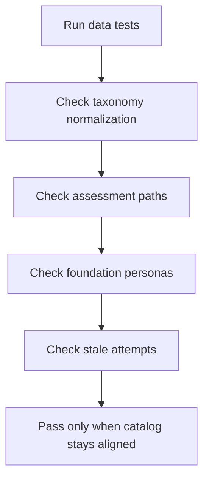

# `learningAssessments.test.ts`

## Sole job

This test file guards the browser-side learning assessment contract: taxonomy normalization, exact Bloom-path selection, foundation-pretest persona split, and saved pre-test freshness against the backend course version.

## Coverage Map

## What the tests prove

- API-shaped modules with missing taxonomy are normalized back into the runtime catalog contract.
- Pre-test, post-test, and post-test-2 question sets match the requested Bloom path exactly.
- Foundation learners remain distinguishable as no knowledge, fundamentals only, some knowledge, or proficient.
- Persisted foundation evidence is evaluated from assessment attempts and answers rather than the local-only pre-test flag.
- Pre-test attempts created before `courseUpdatedAt` are stale and do not satisfy the learning-path gate.
- A fresh attempt after `courseUpdatedAt` can satisfy the gate when it demonstrates remembering, understanding, and applying.

## Ownership Boundary

These tests do not mock Express routes or database writes. They stay inside the local catalog, grading logic, and persisted-assessment interpretation shape so failures point directly at the browser-side contract.

## Acceptance Checks

- Freshness checks use `courseUpdatedAt` from the server response.
- Stale passing attempts fail the gate.
- Fresh passing attempts keep the foundation bypass behavior intact.
- Preview-only admin AI course plans are outside this test file because they never create an assessment response or course timestamp by themselves.
