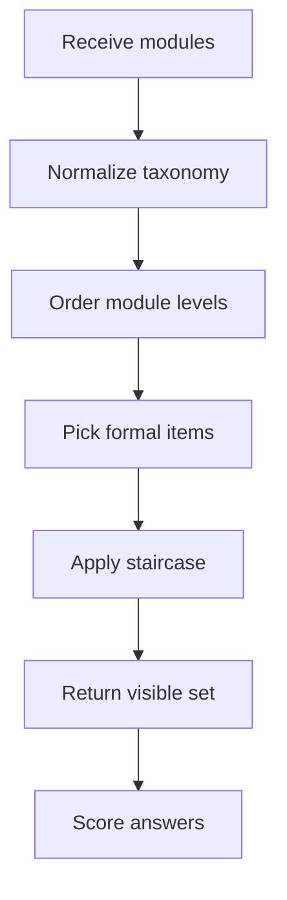
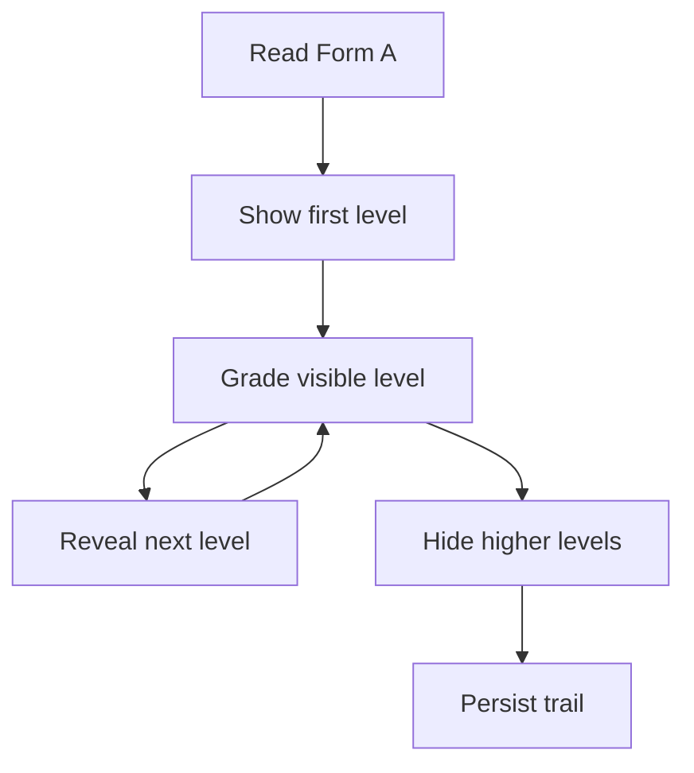
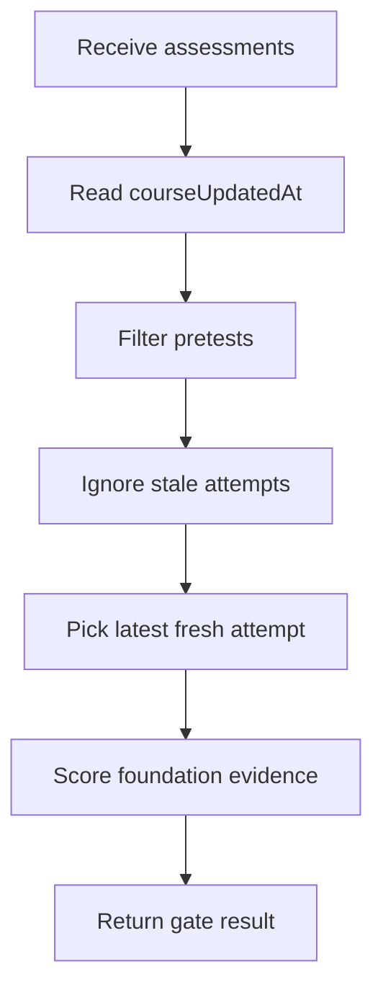

# `learningAssessments.ts`

## Sole job

This module builds the pre-test, post-test, and post-test-2 question sets, grades those answers locally, applies the pre-test Bloom staircase, and derives the foundation bypass evidence used by the learner gate. Per-module stored-history interpretation is mirrored by `pretestModuleOutcomes.ts` so live submissions, reloads, dashboards, and post-test gates agree on the same mastery rule.

## Program Flow

## Pre-Test Staircase Flow

The pre-test is built from the full authored Form A bank, then delivery is narrowed by the learner's current answers. Each module starts at its first available Bloom level. A passed level reveals the next level for that module. The first failed or unanswered level stops the module trail, and higher-level answers are pruned before save.

## Server-Backed Freshness Flow

Saved attempts are only trusted when they include recorded answers and are newer than the course version returned by the backend.

## Assessment Selection Rule

- Formal pre-tests draw Form A and formal post-tests draw Form B.
- The pre-test question bank may contain the full authored form, but `filterPretestStaircaseQuestions(...)` exposes only the current valid trail per module.
- `derivePretestBloomMasteryByModule(...)` stores the highest consecutive passed Bloom level per module; a first-level miss writes `0` so stale saved mastery is cleared, and a perfect available trail is promoted to level `6` so the module can be exempted.
- Duplicate authored items in the same Bloom bucket do not create duplicate mastery requirements; the first authored item for that level is the staircase gate.
- Post-test and post-test-2 remain full-form assessments for the frozen module set.
- Studio questions use a boolean pass/fail answer. `true` is correct, `false` is a completed failed answer, and missing data remains unanswered.

## Foundation Gate

The foundation pretest still passes only when the learner demonstrates the bypass taxonomies the gate cares about:
- remembering
- understanding
- applying

There are two evaluation paths:
- `evaluateFoundationPretest(...)` grades the current in-browser submission before it is saved.
- `evaluateFoundationPretestFromAssessments(...)` reads persisted attempts and ignores any pre-test whose `createdAt` is older than `courseUpdatedAt`.
- `derivePretestModuleOutcomes(...)` in the logic folder consumes the same saved attempts to derive per-module mastered Bloom levels, failed modules, and fully exempt modules with the same consecutive-level rule.

The backend stores raw selections, free-text responses, question metadata, and the global `course_updated_at` setting. This module performs the client-side interpretation of that saved evidence.

## Reset Semantics

- A `courseUpdatedAt` value means an admin changed the learner-visible course contract.
- Pre-test attempts created before that timestamp, or attempts without recorded answers, are stale and cannot unlock the path.
- The comparison is attempt-level: an older passing pre-test is ignored even if the learner still has a local `preTestCompleted` flag.
- A missing fresh attempt returns failed evidence with the foundation bypass taxonomies marked as missing.
- Preview-only AI course plans do not appear here because they do not mutate course rows and do not bump `course_updated_at`.

## Acceptance Checks

- Pre-test starts each module at the first authored Bloom level and reveals only the next level after a correct answer.
- A failed pre-test level hides higher levels for that module and prunes any stale higher-level answer.
- Stored pre-test scoring rebuilds the staircase trail rather than counting hidden future questions.
- Post-test and post-test-2 question counts match the frozen module set.
- Formal pre-test and post-test questions keep the intended Bloom taxonomy labels.
- Studio failures can be submitted as completed failed answers for adaptive pre-test pruning.
- Foundation personas remain distinguishable by mastered and missing taxonomies.
- Saved pre-test evidence older than `courseUpdatedAt` fails the gate.
- A saved fresh passing pre-test can unlock the path without relying on local-only state.
