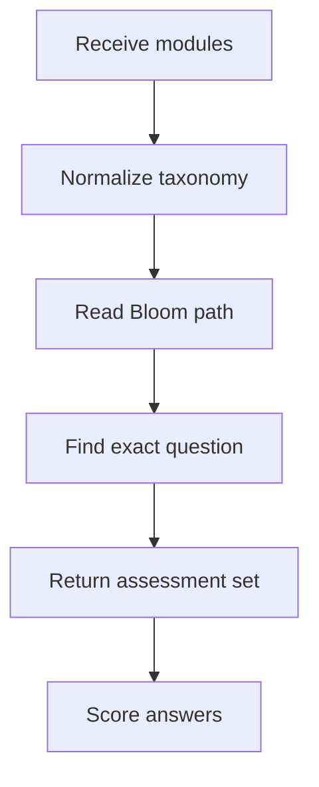
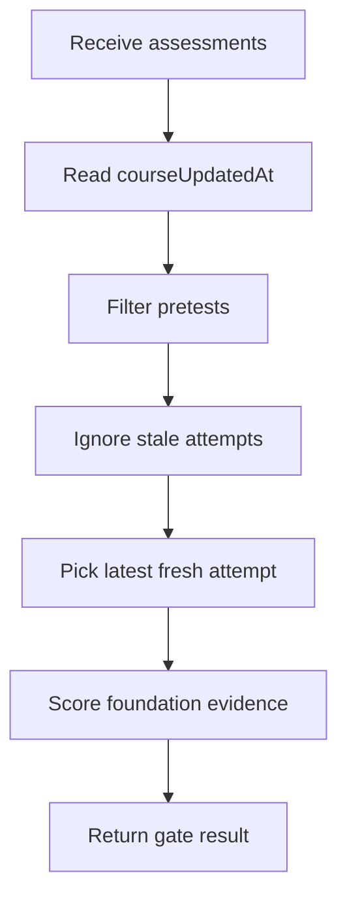

# `learningAssessments.ts`

## Sole job

This module builds the pre-test, post-test, and post-test-2 question sets, grades those answers locally, and derives the foundation bypass evidence used by the learner gate. It also evaluates saved server assessment history against the current course freshness timestamp.

## Program Flow

## Server-Backed Freshness Flow

Saved attempts are only trusted when they include recorded answers and are newer than the course version returned by the backend.

## Exact-Match Rule

- Assessment paths request specific Bloom levels in a fixed sequence.
- `buildLearningAssessmentQuestions(...)` now searches the full eligible module pool for an exact taxonomy match.
- It prefers unused modules and questions first, then reuses an exact-taxonomy question when the catalog is compact.
- If the catalog cannot satisfy the requested level, the function throws instead of silently substituting a wrong-taxonomy question.
- The builder normalizes API-shaped modules before selection, so a missing taxonomy field in seed-loaded data does not break the assessment contract.

## Foundation Gate

The foundation pretest still passes only when the learner demonstrates the bypass taxonomies the gate cares about:
- remembering
- understanding
- applying

There are two evaluation paths:
- `evaluateFoundationPretest(...)` grades the current in-browser submission before it is saved.
- `evaluateFoundationPretestFromAssessments(...)` reads persisted attempts and ignores any pre-test whose `createdAt` is older than `courseUpdatedAt`.

The backend stores raw selections, free-text responses, question metadata, and the global `course_updated_at` setting. This module performs the client-side interpretation of that saved evidence.

## Reset Semantics

- A `courseUpdatedAt` value means an admin changed the learner-visible course contract.
- Pre-test attempts created before that timestamp, or attempts without recorded answers, are stale and cannot unlock the path.
- The comparison is attempt-level: an older passing pre-test is ignored even if the learner still has a local `preTestCompleted` flag.
- A missing fresh attempt returns failed evidence with the foundation bypass taxonomies marked as missing.
- Preview-only AI course plans do not appear here because they do not mutate course rows and do not bump `course_updated_at`.

## Acceptance Checks

- Pre-test, post-test, and post-test-2 sequences match their requested Bloom paths.
- No wrong-taxonomy fallback is used during question selection.
- Compact catalogs may reuse exact-taxonomy questions instead of failing on uniqueness alone.
- Foundation personas remain distinguishable by mastered and missing taxonomies.
- Saved pre-test evidence older than `courseUpdatedAt` fails the gate.
- A saved fresh passing pre-test can unlock the path without relying on local-only state.
