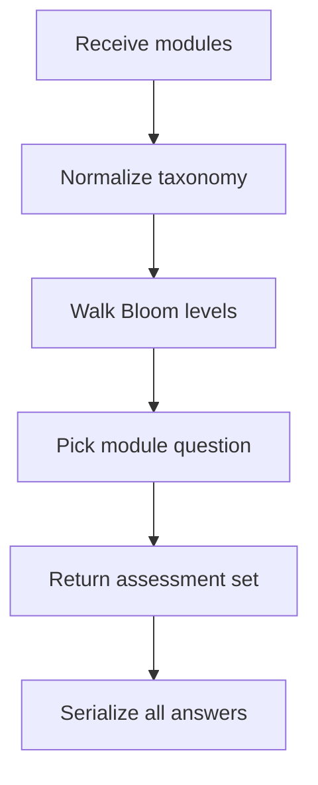
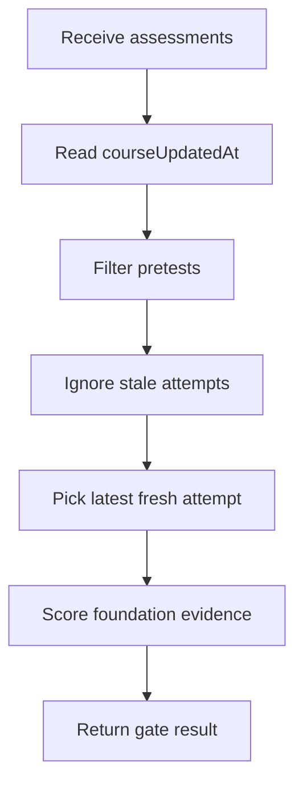

# `learningAssessments.ts`

## Sole job

This module builds the pre-test, post-test, and post-test-2 question sets, serializes every rendered question for server grading, and derives foundation bypass evidence from saved results. Per-module mastery/exemption is owned by `pretestModuleOutcomes.ts`.

## Program Flow

## Server-Backed Freshness Flow

Saved attempts are only trusted when they include recorded answers and are newer than the course version returned by the backend.

## Assessment Selection Rule

- The pre-test builds six Bloom stages and each stage contains one question per learner-visible module.
- Post-test and post-test-2 each contain one question per learner-visible module, using later Bloom stages for checkpoint coverage.
- The builder normalizes API-shaped modules before selection, so every module with a theoretical bank exposes one question per Bloom level.
- Sparse authored banks reuse available questions as fallback during normalization while keeping the emitted taxonomy at the intended Bloom level.
- Studio questions use a boolean pass/fail answer. `true` is correct, `false` is a completed failed answer, and missing data remains unanswered.

## Foundation Gate

The foundation pretest still passes only when the learner demonstrates the bypass taxonomies the gate cares about:
- remembering
- understanding
- applying

There are two evaluation paths:
- `evaluateFoundationPretest(...)` grades the current in-browser submission before it is saved.
- `evaluateFoundationPretestFromAssessments(...)` reads persisted attempts and ignores any pre-test whose `createdAt` is older than `courseUpdatedAt`.
- `derivePretestModuleOutcomes(...)` in the logic folder consumes the same saved attempts to derive per-module mastered Bloom levels, failed modules, and fully exempt modules.

The backend stores selections, free-text responses, canonical taxonomy, per-answer correctness, attempt scores, and the global `course_updated_at` setting. This module prefers backend correctness when interpreting saved evidence.

## Reset Semantics

- A `courseUpdatedAt` value means an admin changed the learner-visible course contract.
- Pre-test attempts created before that timestamp, or attempts without recorded answers, are stale and cannot unlock the path.
- The comparison is attempt-level: an older passing pre-test is ignored even if the learner still has a local `preTestCompleted` flag.
- A missing fresh attempt returns failed evidence with the foundation bypass taxonomies marked as missing.
- Preview-only AI course plans do not appear here because they do not mutate course rows and do not bump `course_updated_at`.

## Acceptance Checks

- Pre-test stage counts match the learner-visible module count.
- Post-test and post-test-2 question counts match the learner-visible module count.
- Pre-test, post-test, and post-test-2 questions keep the intended Bloom taxonomy labels.
- Sparse module banks still expose six Bloom-level pre-test questions after normalization.
- Studio failures can be submitted as completed failed answers for adaptive pre-test pruning.
- Unanswered questions remain in the serialized payload with `selectedIndex = -1`.
- Foundation personas remain distinguishable by mastered and missing taxonomies.
- Saved pre-test evidence older than `courseUpdatedAt` fails the gate.
- A saved fresh passing pre-test can unlock the path without relying on local-only state.
