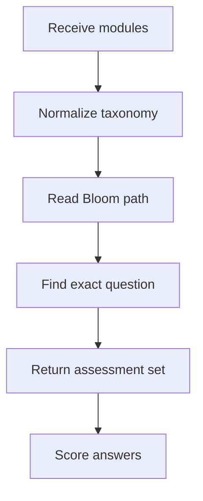

# `learningAssessments.ts`

## Sole job

This module builds the pre-test, post-test, and post-test-2 question sets, grades those answers locally, and derives the foundation bypass evidence used by the learner gate.

## Program Flow

## Exact-Match Rule

- Assessment paths request specific Bloom levels in a fixed sequence.
- `buildLearningAssessmentQuestions(...)` now searches the full eligible module pool for an exact taxonomy match.
- It prefers unused modules and questions first, then reuses an exact-taxonomy question when the catalog is compact.
- If the catalog cannot satisfy the requested level, the function throws instead of silently substituting a wrong-taxonomy question.
- The builder normalizes API-shaped modules before selection, so a missing taxonomy field in seed-loaded data does not break the assessment contract.

## Foundation Gate

The foundation pretest still passes only when the learner demonstrates the bypass taxonomies the gate cares about:
- remembering
- understanding
- applying

The grading helpers keep the results local; the backend only stores the raw selections and metadata.

## Acceptance Checks

- Pre-test, post-test, and post-test-2 sequences match their requested Bloom paths.
- No wrong-taxonomy fallback is used during question selection.
- Compact catalogs may reuse exact-taxonomy questions instead of failing on uniqueness alone.
- Foundation personas remain distinguishable by mastered and missing taxonomies.
