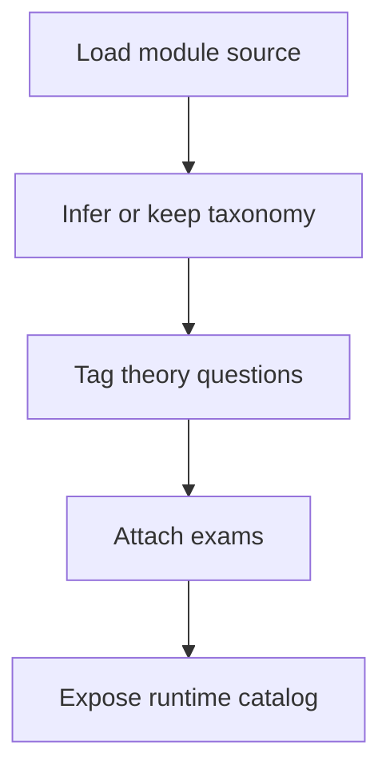

# `learningModules.ts`

## Sole job

This module defines the canonical learning catalog shape and builds the runtime `LEARNING_MODULES` list. It owns Bloom taxonomy tagging for theory questions, taxonomy normalization for API-shaped modules, and the default taxonomy for practical prompts.

## Read Order

Read the file from top to bottom:
1. Type definitions for the learning catalog.
2. Bloom taxonomy inference and normalization helpers.
3. Static module authoring blocks.
4. `attachExams(...)`, which turns authored module content into the runtime catalog.

## Program Flow

## Taxonomy Contract

- Static authored questions may omit `taxonomy`; the file infers it from the question text, explanation, or code snippet.
- `normalizeLearningModule(...)` and `normalizeLearningModules(...)` restore missing taxonomy and expose one theory question for each of the six Bloom levels.
- Sparse authored theory banks reuse available questions as fallback so the learner-side default module bank still has six Bloom-level questions.
- `attachExams(...)` still shuffles the authored static theory bank so the bundled catalog does not always present the same question order.
- Practical exams receive a default taxonomy when the source module does not declare one.

## Ownership Boundary

This file owns local catalog shaping only. It does not fetch remote modules, grade answers, or decide which question a learner sees on a specific assessment screen.

## Acceptance Checks

- Every runtime module question has a taxonomy after normalization.
- Each runtime module with a theory bank exposes all six Bloom levels after normalization.
- API-loaded modules with missing taxonomy still normalize to the same browser contract as the static catalog.
