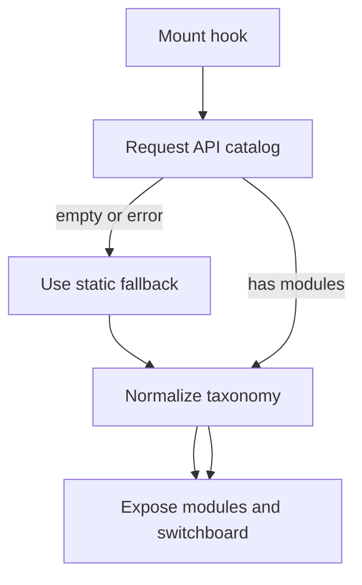

# `useLearningModules.ts`

## Sole job

This hook chooses the active learning-module source for the learner page and normalizes that source before consumers read it. It prefers the public API when available and falls back to the bundled static catalog when the API is empty or unavailable.

## Program Flow

## Ownership Boundary

- The hook owns source selection and browser-side normalization only.
- It does not shape server payloads or decide assessment difficulty.
- It keeps API-loaded seed modules and static fallback modules in the same runtime contract before the learner pages read them.

## Acceptance Checks

- Empty or failed API loads return the bundled catalog.
- API-loaded modules get taxonomy normalized before they reach consumers.
- Static fallback modules are normalized through the same helper path.
