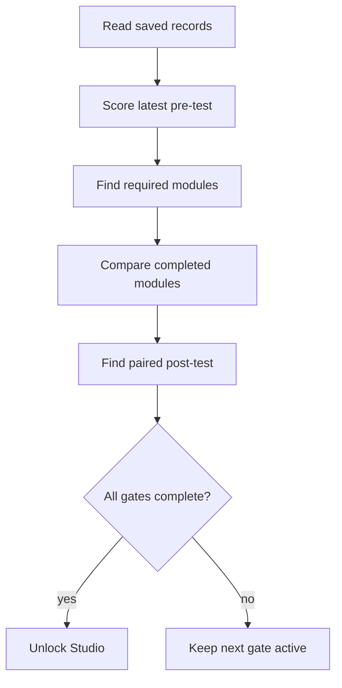

# `internLearningStatus.ts`

## Sole job

Derive the intern's shared learning gate from persisted assessment history and learning progress. Dashboard, Post-Test, Learning Path completion, and standalone Studio access consume this helper so they agree on the same required modules and completion state.

## Status flow

## Rules

- A module is required when its latest fresh pre-test result is below the existing proficiency threshold.
- Pre-test-proficient modules are optional and do not block Post-Test readiness.
- Required module completion comes from `learning_progress.completed_module_ids`.
- Post-Test completion must belong to the same assessment cycle as the active pre-test when a cycle id exists.
- Studio unlock requires a fresh Pre-Test, every required module, and the paired Post-Test.

## Acceptance checks

- Pre-test standing identifies the correct required module set.
- Completing modules alone does not unlock Studio.
- A paired Post-Test plus all required modules unlocks Studio.
