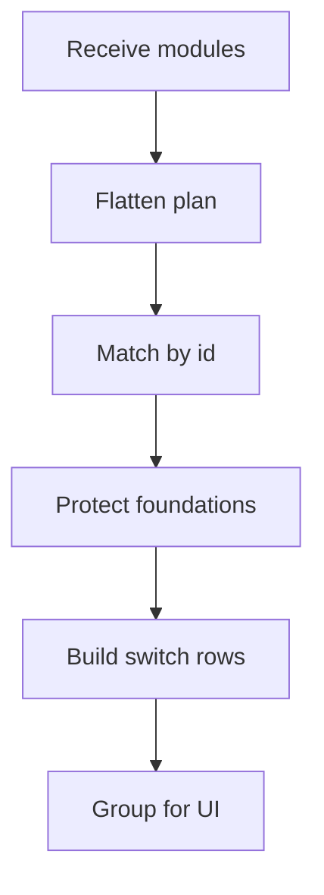

# moduleSwitchboard.ts

`moduleSwitchboard.ts` turns learning modules and an optional course plan into rows the admin UI can preview before publishing. It keeps foundation modules protected and always effective ON, while planner-selected pattern modules can switch between ON and OFF.

## Ownership

- Normalize current module state into stable switch rows.
- Mark foundation modules as protected required learning.
- Preserve AI-selected reasons, sections, and topics for non-foundation modules.
- Group rows by module category for the admin Courses table.

## Flow

## Copy Rule

Foundation modules are described as `required`, not `baseline`, because the admin planner now separates always-on foundation learning from AI-enabled pattern lessons.
