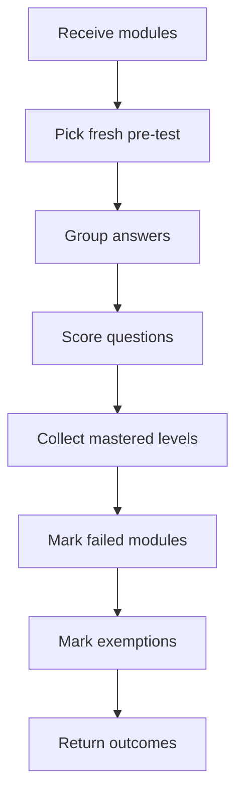

# `pretestModuleOutcomes.ts`

## Sole job

Derive learner-specific module outcomes from saved pre-test assessment history. This helper does not fetch data or mutate progress; it interprets the latest fresh pre-test attempt and returns mastered Bloom levels, failed modules, and fully exempt modules.

## Program Flow

## Rules

- Only the latest fresh pre-test attempt is considered.
- Attempts before `courseUpdatedAt` are ignored.
- Correct answers add that question's Bloom taxonomy to the module mastery set.
- Any incorrect answered question marks that module as failed.
- A module is exempt only when every authored Bloom taxonomy bucket available for that module is mastered and no answered question for the module is incorrect.
- Duplicate questions in one taxonomy do not require duplicate pre-test mastery.

## Acceptance Checks

- Stale attempts do not produce mastered, failed, or exempt modules.
- Partial module coverage can master a level without exempting the module.
- Duplicate questions in one Bloom taxonomy still count as one mastered bucket.
- Failed module ids stay separate from exempt module ids.
