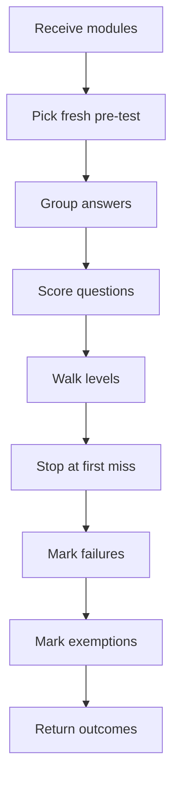

# `pretestModuleOutcomes.ts`

## Sole job

Derive learner-specific module outcomes from saved pre-test assessment history. This helper does not fetch data or mutate progress; it interprets the latest fresh pre-test attempt and returns mastered Bloom levels, a numeric Bloom mastery ceiling per module, failed modules, and fully exempt modules.

## Program Flow

## Rules

- Only the latest fresh pre-test attempt is considered.
- Attempts before `courseUpdatedAt` are ignored.
- Correct answers add that question's Bloom taxonomy only when every lower available level for that module has already passed.
- The numeric `bloomMasteryByModuleId` map stores the highest consecutive mastered Bloom level for each module.
- Any incorrect answered question at the current staircase level marks that module as failed and stops higher-level mastery.
- A module is exempt only when every authored Bloom taxonomy bucket available for that module is mastered in order and no answered current-level question is incorrect.
- Exempt modules are treated as Bloom level 6 for that user.
- Duplicate questions in one taxonomy do not require duplicate pre-test mastery; the first authored item for that taxonomy is the gate.

## Acceptance Checks

- Stale attempts do not produce mastered, failed, or exempt modules.
- Partial module coverage can master a level without exempting the module.
- A mastered ceiling of 5 means levels 1 through 5 can be removed from that user's module bank; level 6 practical work remains unless the module is exempt.
- Passing every available pre-test level promotes the module to mastery level 6 and hides it from the learner path.
- Duplicate questions in one Bloom taxonomy still count as one mastered bucket.
- Failed module ids stay separate from exempt module ids.
