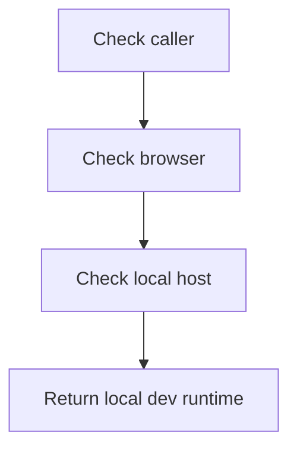

# runtimeEnv.ts

- Source: `Frontend/src/utils/runtimeEnv.ts`
- Kind: frontend runtime-environment helper

## Story
Shared frontend code is compiled by both Vite and the Next.js host. This helper keeps localhost-only dev-tool checks out of bundler-specific `import.meta.env` access so shared components can build under both hosts.

## Flow

## Boundary
- This file only detects local browser runtime context.
- Feature-release checks stay in the caller.
- Localhost dev helpers must call `isLocalDevRuntime()` instead of reading bundler-specific env globals directly.

## Acceptance Checks
- Local dev builds can still expose localhost-only helpers.
- Next.js builds can import shared frontend code without `ImportMeta.env` type errors.
- Production hosts do not satisfy the localhost dev runtime gate.
