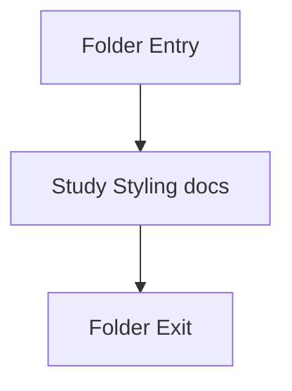

# styles

- Folder: docs/Codebase/Frontend/styles
- Descendant source docs: 2
- Generated on: 2026-04-23

## Logic Summary
Visual system and component styling for the analysis workflow frontend.

## Subsystem Story
This folder is mostly leaf-level. The local documents here carry the main explanation of the subsystem without requiring much extra descent.

## Folder Flow

## Documents By Logic
### Styling
These documents explain the local implementation by covering the visual system for the microservice workflow shell and artifact-review pages.
- components.css.md : Defines component styling for dashboard, analysis, results, diff, fixes, and download surfaces.
- main.css.md : Defines global layout, theme tokens, typography, and shell styling for the analysis workflow.

## Reading Hint
- This folder is mostly leaf-level. Read the local file docs to understand the logic in this area.

