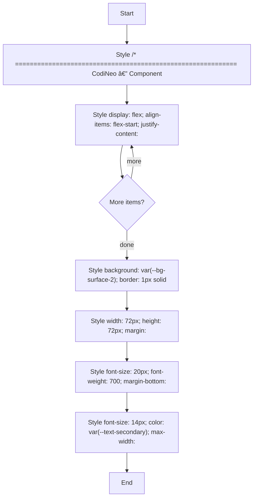

# components.css

- Source: Frontend/styles/components.css
- Kind: CSS stylesheet
- Lines: 591

## Story
### What Happens Here

This stylesheet implements the visual layer of the frontend prototype. It is not executable in the same way as the JavaScript files, but it still participates in the flow by defining how the rendered route shell and components appear.

### Why It Matters In The Flow

Applied during page render to define the frontend presentation layer.

### What To Watch While Reading

Defines the visual system and component styling for the frontend prototype. The main surface area is easiest to track through symbols such as /* ============================================================
   CodiNeo — Component Styles
   Page-specific and reusable components
   ============================================================ */

/* ── Dashboard ─────────────────────────────────────────── */
.dashboard-header, display: flex;
    align-items: flex-start;
    justify-content: space-between;
    gap: 16px;
    margin-bottom: 24px;
}

/* ── Analysis New Page ─────────────────────────────────── */
.ready-card, background: var(--bg-surface-2);
    border: 1px solid var(--border);
    border-radius: var(--radius-lg);
    padding: 40px 24px;
    text-align: center;
    margin: 20px 0;
}

.ready-play-icon, and width: 72px;
    height: 72px;
    margin: 0 auto 18px;
    color: var(--accent-green);
    filter: drop-shadow(0 0 12px rgba(192, 255, 0, 0.3));
}

.ready-title.

## Program Flow
This diagram follows the action path in plain words. Decision diamonds show where the file can stop, branch, or repeat work instead of simply passing through a straight line.

## Reading Map
Read this file as: Defines the visual system and component styling for the frontend prototype.

Where it sits in the run: Applied during page render to define the frontend presentation layer.

Names worth recognizing while reading: /* ============================================================
   CodiNeo — Component Styles
   Page-specific and reusable components
   ============================================================ */

/* ── Dashboard ─────────────────────────────────────────── */
.dashboard-header, display: flex;
    align-items: flex-start;
    justify-content: space-between;
    gap: 16px;
    margin-bottom: 24px;
}

/* ── Analysis New Page ─────────────────────────────────── */
.ready-card, background: var(--bg-surface-2);
    border: 1px solid var(--border);
    border-radius: var(--radius-lg);
    padding: 40px 24px;
    text-align: center;
    margin: 20px 0;
}

.ready-play-icon, width: 72px;
    height: 72px;
    margin: 0 auto 18px;
    color: var(--accent-green);
    filter: drop-shadow(0 0 12px rgba(192, 255, 0, 0.3));
}

.ready-title, font-size: 20px;
    font-weight: 700;
    margin-bottom: 8px;
}

.ready-subtitle, and font-size: 14px;
    color: var(--text-secondary);
    max-width: 360px;
    margin: 0 auto;
}

/* ── Results Page ──────────────────────────────────────── */
.results-project-header.

## Documentation Note
- This markdown file is part of the generated docs/Codebase mirror.
- It was generated from the repository state on 2026-04-23 after reading the existing docs corpus and the current source tree.

