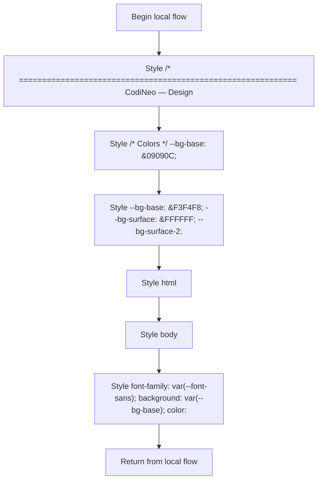

# main.css

- Source: Frontend/styles/main.css
- Kind: CSS stylesheet

## Story
### What Happens Here

This stylesheet implements the global visual layer of the frontend analysis workflow. It is not executable in the same way as the JavaScript files, but it still participates in the flow by defining how the rendered route shell and shared components appear.

### Why It Matters In The Flow

Applied during page render to define the frontend presentation layer.

### What To Watch While Reading

Defines the visual system and shell styling for the microservice workflow frontend. The main surface area is easiest to track through symbols such as /* ============================================================
   CodiNeo — Design System
   Color palette and tokens derived from Figma wireframe
   ============================================================ */

@import url('https://fonts.googleapis.com/css2?family=Inter:wght@300;400;500;600;700;800&family=JetBrains+Mono:wght@400;500&display=swap');

/* ── CSS Custom Properties ─────────────────────────────── */
:root, /* Colors */
  --bg-base:        #09090C;
  --bg-surface:     #111116;
  --bg-surface-2:   #18181F;
  --bg-surface-3:   #1F1F28;
  --bg-overlay:     rgba(0,0,0,0.65);

  --accent-green:   #C0FF00;
  --accent-green-glow: rgba(192,255,0,0.18);
  --accent-green-dim:  #8BBF00;
  --accent-purple:  #8B5CF6;
  --accent-purple-glow: rgba(139,92,246,0.18);
  --accent-yellow:  #F59E0B;
  --accent-red:     #EF4444;
  --accent-red-bg:  rgba(239,68,68,0.15);

  --text-primary:   #FFFFFF;
  --text-secondary: #9CA3AF;
  --text-muted:     #6B7280;

  --border:         rgba(255,255,255,0.07);
  --border-active:  rgba(192,255,0,0.35);
  --border-purple:  rgba(139,92,246,0.35);

  /* Typography */
  --font-sans:  'Inter', system-ui, sans-serif;
  --font-mono:  'JetBrains Mono', 'Courier New', monospace;

  /* Radii */
  --radius-sm:  8px;
  --radius-md:  14px;
  --radius-lg:  20px;
  --radius-xl:  28px;
  --radius-full:999px;

  /* Shadows */
  --shadow-card: 0 2px 20px rgba(0,0,0,0.45);
  --shadow-green: 0 0 24px rgba(192,255,0,0.2);
  --shadow-purple: 0 0 24px rgba(139,92,246,0.2);

  /* Transitions */
  --transition-fast: 0.15s ease;
  --transition-med:  0.25s ease;

  /* Layout */
  --sidebar-width: 280px;
  --topbar-height: 60px;
}

/* Light mode */
[data-theme="light"], --bg-base:       #F3F4F8;
  --bg-surface:    #FFFFFF;
  --bg-surface-2:  #ECEDF3;
  --bg-surface-3:  #E4E5ED;
  --text-primary:  #0D0D12;
  --text-secondary:#52556A;
  --text-muted:    #8A8DA0;
  --border:        rgba(0,0,0,0.08);
  --shadow-card:   0 2px 16px rgba(0,0,0,0.09);
}

/* ── Reset & Base ──────────────────────────────────────── */
*, *::before, *::after, and html. It collaborates directly with https://fonts.googleapis.com/css2?family=Inter:wght@300;400;500;600;700;800&family=JetBrains+Mono:wght@400;500&display=swap.

## Program Flow
This diagram follows the action path in plain words. Decision diamonds show where the file can stop, branch, or repeat work instead of simply passing through a straight line.

## Reading Map
Read this file as: Defines global layout, theme tokens, typography, and shell styling for the analysis workflow.

Where it sits in the run: Applied during page render to define the frontend presentation layer.

Names worth recognizing while reading: /* ============================================================
   CodiNeo — Design System
   Color palette and tokens derived from Figma wireframe
   ============================================================ */

@import url('https://fonts.googleapis.com/css2?family=Inter:wght@300;400;500;600;700;800&family=JetBrains+Mono:wght@400;500&display=swap');

/* ── CSS Custom Properties ─────────────────────────────── */
:root, /* Colors */
  --bg-base:        #09090C;
  --bg-surface:     #111116;
  --bg-surface-2:   #18181F;
  --bg-surface-3:   #1F1F28;
  --bg-overlay:     rgba(0,0,0,0.65);

  --accent-green:   #C0FF00;
  --accent-green-glow: rgba(192,255,0,0.18);
  --accent-green-dim:  #8BBF00;
  --accent-purple:  #8B5CF6;
  --accent-purple-glow: rgba(139,92,246,0.18);
  --accent-yellow:  #F59E0B;
  --accent-red:     #EF4444;
  --accent-red-bg:  rgba(239,68,68,0.15);

  --text-primary:   #FFFFFF;
  --text-secondary: #9CA3AF;
  --text-muted:     #6B7280;

  --border:         rgba(255,255,255,0.07);
  --border-active:  rgba(192,255,0,0.35);
  --border-purple:  rgba(139,92,246,0.35);

  /* Typography */
  --font-sans:  'Inter', system-ui, sans-serif;
  --font-mono:  'JetBrains Mono', 'Courier New', monospace;

  /* Radii */
  --radius-sm:  8px;
  --radius-md:  14px;
  --radius-lg:  20px;
  --radius-xl:  28px;
  --radius-full:999px;

  /* Shadows */
  --shadow-card: 0 2px 20px rgba(0,0,0,0.45);
  --shadow-green: 0 0 24px rgba(192,255,0,0.2);
  --shadow-purple: 0 0 24px rgba(139,92,246,0.2);

  /* Transitions */
  --transition-fast: 0.15s ease;
  --transition-med:  0.25s ease;

  /* Layout */
  --sidebar-width: 280px;
  --topbar-height: 60px;
}

/* Light mode */
[data-theme="light"], --bg-base:       #F3F4F8;
  --bg-surface:    #FFFFFF;
  --bg-surface-2:  #ECEDF3;
  --bg-surface-3:  #E4E5ED;
  --text-primary:  #0D0D12;
  --text-secondary:#52556A;
  --text-muted:    #8A8DA0;
  --border:        rgba(0,0,0,0.08);
  --shadow-card:   0 2px 16px rgba(0,0,0,0.09);
}

/* ── Reset & Base ──────────────────────────────────────── */
*, *::before, *::after, html, body, and font-family: var(--font-sans);
  background: var(--bg-base);
  color: var(--text-primary);
  line-height: 1.6;
  min-height: 100vh;
  display: flex;
  overflow-x: hidden;
}

a.

It leans on nearby contracts or tools such as https://fonts.googleapis.com/css2?family=Inter:wght@300;400;500;600;700;800&family=JetBrains+Mono:wght@400;500&display=swap.

## Documentation Note
- This markdown file is part of the generated docs/Codebase mirror.
- It was generated from the repository state on 2026-04-23 after reading the existing docs corpus and the current source tree.

