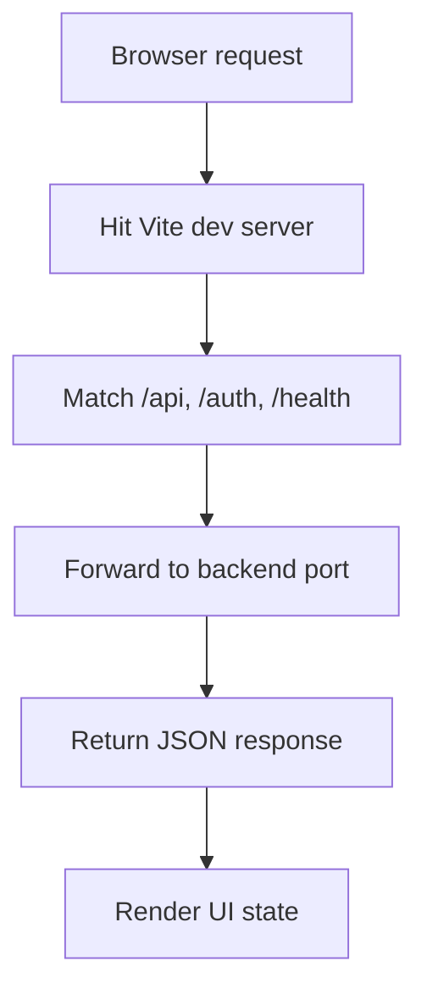

# vite.config.ts

- Source: Frontend/vite.config.ts
- Kind: TypeScript config

## Story
### What Happens Here

This file owns the local dev-server bridge between the browser and the backend API. It keeps the frontend shell on port 5173, while proxying `/api`, `/auth`, and `/health` to the backend port configured by the backend process.

### Why It Matters In The Flow

If the proxy target does not match the live backend, the browser can still render the page shell but auth endpoints will fail. That makes guest seats look empty and Google sign-in look unavailable even when the SQLite data and backend routes are fine.

### What To Watch While Reading

The proxy target must stay aligned with the backend `PORT`. In local development, the frontend does not talk to the backend directly; it talks to Vite first, and Vite forwards the request.

## Program Flow
This diagram follows the browser request path through the local dev stack.

## Reading Map
Read this file as: Local dev proxy wiring for frontend-to-backend requests.

Where it sits in the run: Before the browser ever reaches the backend auth or health routes.

Names worth recognizing while reading: `server`, `proxy`, `port`, and `preview`.

It leans on nearby contracts or tools such as the backend `PORT` value and the shared `/auth` and `/api` route prefixes.

## Implementation Note
- Keep the dev and preview proxy targets in sync with the backend port.
- If the backend port changes, update this config before debugging guest seats or Google auth.

## Acceptance Checks
- `/auth/test-accounts` should reach the live backend in local dev.
- `/auth/google/status` should reach the live backend in local dev.
- `/health` should return the backend status JSON through the proxy.
