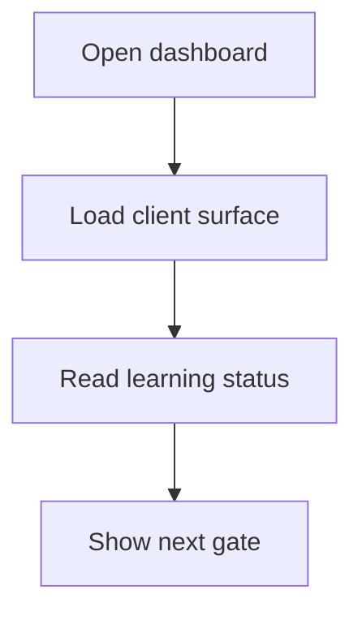

# intern-dashboard route

## Sole job

Expose the browser-only Intern Dashboard at `/intern-dashboard`. The route delegates presentation and gate decisions to the shared frontend `InternDashboard` component.

The legacy `/student-dashboard` route redirects here for existing bookmarks.
