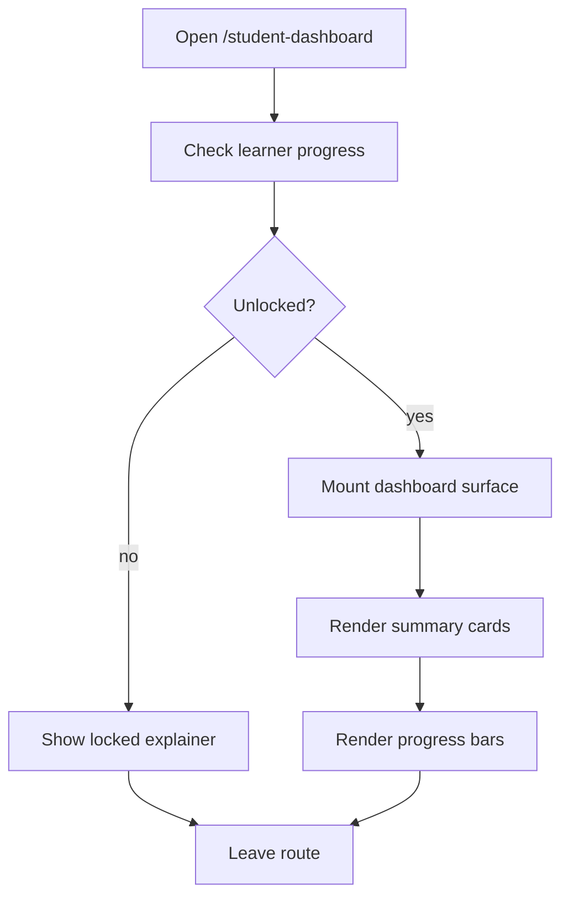

# student-dashboard route

- Folder: docs/Codebase/FrontendNext/app/student-dashboard
- Owner: FrontendNext

## Logic Summary
Route segment for the learner dashboard surface. This is the Next entry point for `/student-dashboard`, which should stay hidden from first-time navigation until the learner completes the first full module.

## Ownership Boundary
This route owns route registration and the thin App Router handoff only. It must not own dashboard state, score math, or unlock logic. Those belong to the shared learner component and the progress API contract.

## Route Contract

- Public navigation should not surface this route until the unlock condition is met.
- If the learner reaches the route directly before unlock, render a locked explanation with a return CTA to the learning flow.
- Once unlocked, the route should render the shared learner dashboard surface client-side.

## Flow

## Reading Hint
- Read this route file after `docs/Codebase/FrontendNext/app/README.md`, then follow the wrapper into `docs/Codebase/Frontend/src/components/learn/StudentDashboard.tsx.md`.

