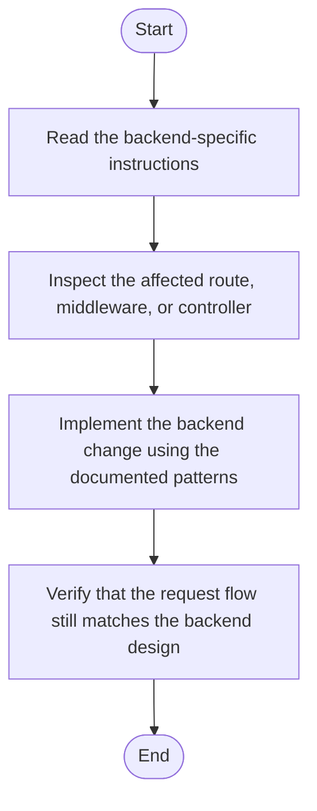

<!-- Use this file to provide workspace-specific custom instructions to Copilot. For more details, visit https://code.visualstudio.com/docs/copilot/copilot-customization#_use-a-githubcopilotinstructionsmd-file -->
- [x] Verify that the copilot-instructions.md file in the .github directory is created.

- [x] Clarify Project Requirements
- [x] Scaffold the Project
- [x] Customize the Project
- [x] Install Required Extensions
- [x] Compile the Project
- [x] Create and Run Task
- [x] Launch the Project
- [x] Ensure Documentation is Complete

All steps completed for Node.js + Express backend with SQLite, JWT, file upload, and modular structure.

<!-- AUTO-IMPLEMENTATION-STORY-START -->

## Implementation Story
This document narrows the repository guidance down to the backend service. It influences how backend implementation work is performed by steering contributors toward the request lifecycle, middleware layering, and service boundaries already present in the Express and SQLite code.

## Activity Diagram

<!-- AUTO-IMPLEMENTATION-STORY-END -->

