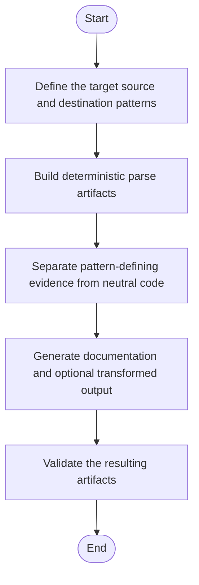

# Microservice Algorithm Plan

## Purpose

Define a deterministic, documentation-first workflow for design pattern analysis in the microservice.

The system will:
- detect existing design patterns in source code
- identify which code regions are pattern-defining vs pattern-neutral
- document the pattern-defining regions for training and onboarding
- support base-code-to-specific-pattern generation mode
- support unit test generation and execution based on detected/selected pattern

## Core Direction Changes

1. Replace pattern-to-pattern conversion as primary workflow.
2. Keep original source pattern and detect only the required pattern-specific parts.
3. Annotate and document only code parts that are truly required by the pattern.
4. Add strict base-code-to-single-pattern training mode (no multi-target choice required).
5. Add capability to generate code and run or generate unit tests for selected pattern context.

## Deterministic Constraints

- Parsing and transformation logic must remain deterministic.
- No probabilistic model should be used in the core analysis path.
- DPDA-driven pipeline remains the reference execution model.
- Hash linking and candidate resolution must be O(1) lookup friendly where feasible.

## Phase Plan

## Phase 1: Construction and Evaluation

Deliverables:
- root tree and per-file nodes
- actual parse tree plus optimized virtual candidate tree
- salted contextual hash mapping between declaration and usage
- candidate dirty-bit tagging for potential pattern-defining nodes

Acceptance criteria:
- same input produces same trees, hashes, and candidate flags
- declaration-usage scope validation is reproducible
- non-candidate syntax remains pruned from virtual candidate tree

## Phase 2: Detection and Abstraction

Deliverables:
- detection pass for known patterns (Factory, Adapter, etc.)
- extraction of pattern-defining sections
- conversion to Intermediate Base Representation (IBR)
- separation of pattern-defining vs pattern-neutral code parts

Acceptance criteria:
- each detected pattern includes explicit evidence set
- each evidence item is traceable to original source location
- neutral code sections are preserved and marked as unchanged

## Phase 3: Generation and Preservation

Deliverables:
- optional deterministic generation from IBR to target pattern form
- strict preservation of untouched AST branches
- documentation output listing required pattern parts and rationale
- unit test artifacts or executable test plan for generated code

Acceptance criteria:
- generated code preserves unaffected code regions
- documentation clearly lists required and unchanged regions
- unit tests validate core behavioral contract of generated result

## Documentation Outputs

Required markdown outputs per run:
- pattern detection summary
- pattern-defining code region list
- unchanged code region list
- comment insertion plan for required pattern parts
- unit test generation/execution summary

## Risks and Mitigations

- False positive pattern detection:
  - Mitigation: require multi-signal evidence (hash scope + structural checks + token sequence checks).
- Over-documentation noise:
  - Mitigation: include only pattern-defining regions and direct dependencies.
- Test drift between generated and preserved regions:
  - Mitigation: preserve tests for unchanged paths and add focused tests only for affected pattern nodes.

## Rollout

1. Implement detection-first mode behind feature flag.
2. Validate on current microservice sample corpus.
3. Enable base-code-to-specific-pattern training mode.
4. Enable test generation/execution pipeline stage.
5. Make documentation outputs default for onboarding workflow.

<!-- AUTO-IMPLEMENTATION-STORY-START -->

## Implementation Story
This planning document corresponds to the same implemented microservice pipeline but describes it from the rollout angle. The codebase currently realizes that plan through the parser, detector, evidence, and report modules in Microservice/Modules, with the application-layer runner coordinating them at execution time.

## Activity Diagram

<!-- AUTO-IMPLEMENTATION-STORY-END -->

