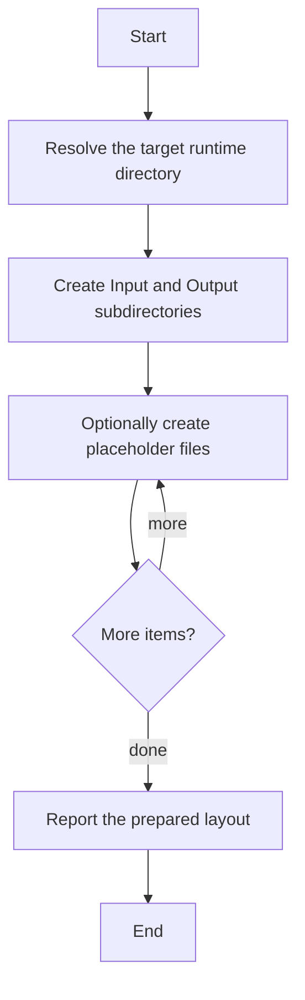

# setup_runtime_layout.ps1

- Source: Infrastructure/runtime-layout/setup_runtime_layout.ps1
- Kind: PowerShell script
- Lines: 53

## Story
### What Happens Here

This script implements the filesystem contract expected by the microservice runtime. It creates the Input and Output subtree and can optionally seed placeholder files so later stages have a predictable directory layout.

### Why It Matters In The Flow

Runs before the C++ executable when the environment, runtime folders, container image, or Kubernetes assets need to be prepared.

### What To Watch While Reading

Creates the Input and Output directory layout expected by the microservice runtime. The main surface area is easiest to track through symbols such as $TargetDir, $CreatePlaceholders, $runtimeRoot, and $inputDir.

## Program Flow
This diagram follows the action path in plain words. Decision diamonds show where the file can stop, branch, or repeat work instead of simply passing through a straight line.

## Reading Map
Read this file as: Creates the Input and Output directory layout expected by the microservice runtime.

Where it sits in the run: Runs before the C++ executable when the environment, runtime folders, container image, or Kubernetes assets need to be prepared.

Names worth recognizing while reading: $TargetDir, $CreatePlaceholders, $runtimeRoot, $inputDir, $outputDir, and $analysisDir.

## Documentation Note
- This markdown file is part of the generated docs/Codebase mirror.
- It was generated from the repository state on 2026-04-23 after reading the existing docs corpus and the current source tree.

