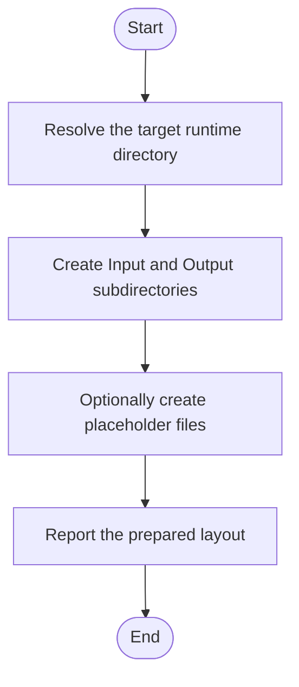

# setup_runtime_layout.ps1

- Source: Infrastructure/runtime-layout/setup_runtime_layout.ps1
- Kind: PowerShell script
- Lines: 53
- Role: Creates the Input and Output directory layout expected by the microservice runtime.
- Chronology: Runs before the C++ executable when the environment, runtime folders, container image, or Kubernetes assets need to be prepared.

## Notable Symbols
- $TargetDir
- $CreatePlaceholders
- $runtimeRoot
- $inputDir
- $outputDir
- $analysisDir
- $generatedCodeDir
- $htmlDir
- $dirs
- $dir
- $inputReadmePath
- $placeholder

## Direct Dependencies
- No direct dependency list was extracted from the file text.

## Implementation Story
This script implements the filesystem contract expected by the microservice runtime. It creates the Input and Output subtree and can optionally seed placeholder files so later stages have a predictable directory layout. Creates the Input and Output directory layout expected by the microservice runtime. Runs before the C++ executable when the environment, runtime folders, container image, or Kubernetes assets need to be prepared. The implementation surface is easiest to recognize through symbols such as $TargetDir, $CreatePlaceholders, $runtimeRoot, and $inputDir.

## Activity Diagram

## Documentation Note
- This markdown file is part of the generated docs/Codebase mirror.
- It was generated from the repository state on 2026-04-22 after reading the existing docs corpus and the current source tree.

