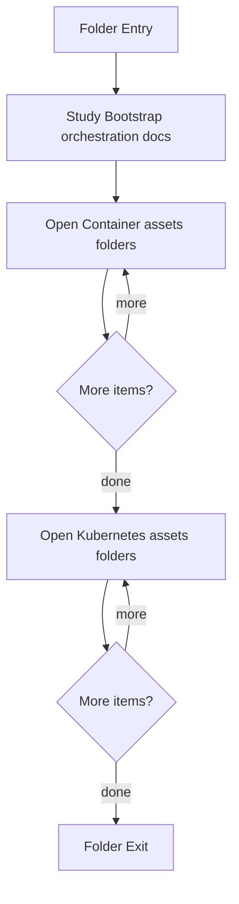

# session-orchestration

- Folder: docs/Codebase/Infrastructure/session-orchestration
- Descendant source docs: 5
- Generated on: 2026-04-23

## Logic Summary
Session bootstrap logic that prepares Docker, Minikube, runtime images, templates, and runtime folders.

## Subsystem Story
This folder mixes concrete local documents with deeper child subsystems. Read the local docs to understand the visible behavior first, then descend into the child folders for the lower-level detail that supports it.

## Folder Flow

## Child Folders By Logic
### Container Assets
These child folders continue the subsystem by covering Container image definitions used by the orchestration bootstrap.
- docker/ : Container image definitions used by the orchestration bootstrap.

### Kubernetes Assets
These child folders continue the subsystem by covering Kubernetes deployment-side assets for user-scoped runtime sessions.
- k8s/ : Kubernetes deployment-side assets for user-scoped runtime sessions.

## Documents By Logic
### Bootstrap Orchestration
These documents explain the local implementation by covering Automates dependency install, Docker and Minikube startup, image build, template deployment, and runtime layout preparation. and Parameterizes the infrastructure bootstrap flow with image, profile, template, and runtime-root values.
- bootstrap_and_deploy.ps1.md : Automates dependency install, Docker and Minikube startup, image build, template deployment, and runtime layout preparation.
- installer.config.json.md : Parameterizes the infrastructure bootstrap flow with image, profile, template, and runtime-root values.

## Reading Hint
- Read the local file docs first for concrete behavior, then descend into the child folders for narrower subsystem details.

