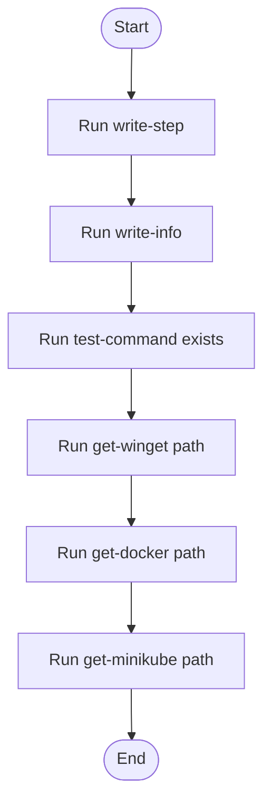

# bootstrap_and_deploy.ps1

- Source: Infrastructure/session-orchestration/bootstrap_and_deploy.ps1
- Kind: PowerShell script
- Lines: 612
- Role: Automates dependency install, Docker and Minikube startup, image build, template deployment, and runtime layout preparation.
- Chronology: Runs before the C++ executable when the environment, runtime folders, container image, or Kubernetes assets need to be prepared.

## Notable Symbols
- Write-Step
- Write-Info
- Test-CommandExists
- Get-WingetPath
- Get-DockerPath
- Get-MinikubePath
- Get-KubectlPath
- Invoke-ExternalCommand
- Install-WithWinget
- Wait-ForDocker
- Test-MinikubeProfileCorrupted
- Invoke-MinikubeDeleteBestEffort

## Direct Dependencies
- docker
- kubectl
- minikube
- winget
- Codebase/Infrastructure/runtime-layout/setup_runtime_layout.ps1

## File Outline
### Responsibility

This script implements the full environment bring-up path for NeoTerritory. It loads configuration, resolves dependency availability, starts Docker and Minikube when needed, builds the runtime image, applies Kubernetes templates, and finally prepares the folder layout consumed by the executable.

### Position In The Flow

Runs before the C++ executable when the environment, runtime folders, container image, or Kubernetes assets need to be prepared.

### Main Surface Area

Automates dependency install, Docker and Minikube startup, image build, template deployment, and runtime layout preparation. The main surface area is easiest to track through symbols such as Write-Step, Write-Info, Test-CommandExists, and Get-WingetPath. It collaborates directly with docker, kubectl, minikube, and winget.

## File Activity


## Function Walkthrough

### Write-Step
This routine materializes internal state into an output format that later stages can consume. It appears near line 17.

Inside the body, it mainly handles report status or failures to the caller.

Key operations:
- report status or failures to the caller

Activity:
```mermaid
flowchart TD
    Start([Write-Step()])
    N0[Enter Write-Step()]
    N1[Report status or failures to the caller]
    N2[Hand control back to the caller]
    End([Return])
    Start --> N0
    N0 --> N1
    N1 --> N2
    N2 --> End
```

### Write-Info
This routine materializes internal state into an output format that later stages can consume. It appears near line 22.

Inside the body, it mainly handles report status or failures to the caller.

Key operations:
- report status or failures to the caller

Activity:
```mermaid
flowchart TD
    Start([Write-Info()])
    N0[Enter Write-Info()]
    N1[Report status or failures to the caller]
    N2[Hand control back to the caller]
    End([Return])
    Start --> N0
    N0 --> N1
    N1 --> N2
    N2 --> End
```

### Test-CommandExists
This routine owns one focused piece of the file's behavior. It appears near line 27.

The caller receives a computed result or status from this step.

Key operations:
- This routine is primarily structural and does not expose obvious runtime operations from static inspection.

Activity:
```mermaid
flowchart TD
    Start([Test-CommandExists()])
    N0[Enter Test-CommandExists()]
    N1[Apply the routine's local logic]
    N2[Return the result to the caller]
    End([Return])
    Start --> N0
    N0 --> N1
    N1 --> N2
    N2 --> End
```

### Get-WingetPath
This routine owns one focused piece of the file's behavior. It appears near line 32.

Inside the body, it mainly handles inspect the current filesystem state and branch on runtime conditions.

It branches on runtime conditions instead of following one fixed path. The caller receives a computed result or status from this step.

Key operations:
- inspect the current filesystem state
- branch on runtime conditions

Activity:
```mermaid
flowchart TD
    Start([Get-WingetPath()])
    N0[Enter Get-WingetPath()]
    N1[Inspect the current filesystem state]
    N2[Branch on runtime conditions]
    N3[Return the result to the caller]
    End([Return])
    Start --> N0
    N0 --> N1
    N1 --> N2
    N2 --> N3
    N3 --> End
```

### Get-DockerPath
This routine owns one focused piece of the file's behavior. It appears near line 56.

Inside the body, it mainly handles inspect the current filesystem state, invoke external tooling, branch on runtime conditions, and iterate over the active collection.

The implementation iterates over a collection or repeated workload. It branches on runtime conditions instead of following one fixed path. The caller receives a computed result or status from this step.

Key operations:
- inspect the current filesystem state
- invoke external tooling
- branch on runtime conditions
- iterate over the active collection

Activity:
```mermaid
flowchart TD
    Start([Get-DockerPath()])
    N0[Enter Get-DockerPath()]
    N1[Inspect the current filesystem state]
    N2[Invoke external tooling]
    N3[Branch on runtime conditions]
    N4[Iterate over the active collection]
    N5[Return the result to the caller]
    End([Return])
    Start --> N0
    N0 --> N1
    N1 --> N2
    N2 --> N3
    N3 --> N4
    N4 --> N5
    N5 --> End
```

### Get-MinikubePath
This routine owns one focused piece of the file's behavior. It appears near line 82.

Inside the body, it mainly handles inspect the current filesystem state, invoke external tooling, branch on runtime conditions, and iterate over the active collection.

The implementation iterates over a collection or repeated workload. It branches on runtime conditions instead of following one fixed path. The caller receives a computed result or status from this step.

Key operations:
- inspect the current filesystem state
- invoke external tooling
- branch on runtime conditions
- iterate over the active collection

Activity:
```mermaid
flowchart TD
    Start([Get-MinikubePath()])
    N0[Enter Get-MinikubePath()]
    N1[Inspect the current filesystem state]
    N2[Invoke external tooling]
    N3[Branch on runtime conditions]
    N4[Iterate over the active collection]
    N5[Return the result to the caller]
    End([Return])
    Start --> N0
    N0 --> N1
    N1 --> N2
    N2 --> N3
    N3 --> N4
    N4 --> N5
    N5 --> End
```

### Get-KubectlPath
This routine owns one focused piece of the file's behavior. It appears near line 109.

Inside the body, it mainly handles inspect the current filesystem state, invoke external tooling, branch on runtime conditions, and iterate over the active collection.

The implementation iterates over a collection or repeated workload. It branches on runtime conditions instead of following one fixed path. The caller receives a computed result or status from this step.

Key operations:
- inspect the current filesystem state
- invoke external tooling
- branch on runtime conditions
- iterate over the active collection

Activity:
```mermaid
flowchart TD
    Start([Get-KubectlPath()])
    N0[Enter Get-KubectlPath()]
    N1[Inspect the current filesystem state]
    N2[Invoke external tooling]
    N3[Branch on runtime conditions]
    N4[Iterate over the active collection]
    N5[Return the result to the caller]
    End([Return])
    Start --> N0
    N0 --> N1
    N1 --> N2
    N2 --> N3
    N3 --> N4
    N4 --> N5
    N5 --> End
```

### Invoke-ExternalCommand
This routine owns one focused piece of the file's behavior. It appears near line 136.

Inside the body, it mainly handles report status or failures to the caller and branch on runtime conditions.

It branches on runtime conditions instead of following one fixed path.

Key operations:
- report status or failures to the caller
- branch on runtime conditions

Activity:
```mermaid
flowchart TD
    Start([Invoke-ExternalCommand()])
    N0[Enter Invoke-ExternalCommand()]
    N1[Report status or failures to the caller]
    N2[Branch on runtime conditions]
    N3[Hand control back to the caller]
    End([Return])
    Start --> N0
    N0 --> N1
    N1 --> N2
    N2 --> N3
    N3 --> End
```

### Install-WithWinget
This routine owns one focused piece of the file's behavior. It appears near line 148.

Inside the body, it mainly handles report status or failures to the caller and branch on runtime conditions.

It branches on runtime conditions instead of following one fixed path. The caller receives a computed result or status from this step.

Key operations:
- report status or failures to the caller
- branch on runtime conditions

Activity:
```mermaid
flowchart TD
    Start([Install-WithWinget()])
    N0[Enter Install-WithWinget()]
    N1[Report status or failures to the caller]
    N2[Branch on runtime conditions]
    N3[Return the result to the caller]
    End([Return])
    Start --> N0
    N0 --> N1
    N1 --> N2
    N2 --> N3
    N3 --> End
```

### Wait-ForDocker
This routine owns one focused piece of the file's behavior. It appears near line 178.

Inside the body, it mainly handles report status or failures to the caller, invoke external tooling, branch on runtime conditions, and iterate over the active collection.

The implementation iterates over a collection or repeated workload. It branches on runtime conditions instead of following one fixed path. The caller receives a computed result or status from this step.

Key operations:
- report status or failures to the caller
- invoke external tooling
- branch on runtime conditions
- iterate over the active collection

Activity:
```mermaid
flowchart TD
    Start([Wait-ForDocker()])
    N0[Enter Wait-ForDocker()]
    N1[Report status or failures to the caller]
    N2[Invoke external tooling]
    N3[Branch on runtime conditions]
    N4[Iterate over the active collection]
    N5[Return the result to the caller]
    End([Return])
    Start --> N0
    N0 --> N1
    N1 --> N2
    N2 --> N3
    N3 --> N4
    N4 --> N5
    N5 --> End
```

### Test-MinikubeProfileCorrupted
This routine owns one focused piece of the file's behavior. It appears near line 205.

Inside the body, it mainly handles inspect the current filesystem state and invoke external tooling.

The caller receives a computed result or status from this step.

Key operations:
- inspect the current filesystem state
- invoke external tooling

Activity:
```mermaid
flowchart TD
    Start([Test-MinikubeProfileCorrupted()])
    N0[Enter Test-MinikubeProfileCorrupted()]
    N1[Inspect the current filesystem state]
    N2[Invoke external tooling]
    N3[Return the result to the caller]
    End([Return])
    Start --> N0
    N0 --> N1
    N1 --> N2
    N2 --> N3
    N3 --> End
```

### Invoke-MinikubeDeleteBestEffort
This routine owns one focused piece of the file's behavior. It appears near line 219.

Inside the body, it mainly handles report status or failures to the caller, invoke external tooling, and branch on runtime conditions.

It branches on runtime conditions instead of following one fixed path.

Key operations:
- report status or failures to the caller
- invoke external tooling
- branch on runtime conditions

Activity:
```mermaid
flowchart TD
    Start([Invoke-MinikubeDeleteBestEffort()])
    N0[Enter Invoke-MinikubeDeleteBestEffort()]
    N1[Report status or failures to the caller]
    N2[Invoke external tooling]
    N3[Branch on runtime conditions]
    N4[Hand control back to the caller]
    End([Return])
    Start --> N0
    N0 --> N1
    N1 --> N2
    N2 --> N3
    N3 --> N4
    N4 --> End
```

### Remove-MinikubeProfileArtifacts
This routine owns one focused piece of the file's behavior. It appears near line 256.

Inside the body, it mainly handles inspect the current filesystem state, create or update filesystem artifacts, report status or failures to the caller, and invoke external tooling.

The implementation iterates over a collection or repeated workload. It branches on runtime conditions instead of following one fixed path.

Key operations:
- inspect the current filesystem state
- create or update filesystem artifacts
- report status or failures to the caller
- invoke external tooling
- branch on runtime conditions
- iterate over the active collection

Activity:
```mermaid
flowchart TD
    Start([Remove-MinikubeProfileArtifacts()])
    N0[Enter Remove-MinikubeProfileArtifacts()]
    N1[Inspect the current filesystem state]
    N2[Create or update filesystem artifacts]
    N3[Report status or failures to the caller]
    N4[Invoke external tooling]
    N5[Branch on runtime conditions]
    N6[Hand control back to the caller]
    End([Return])
    Start --> N0
    N0 --> N1
    N1 --> N2
    N2 --> N3
    N3 --> N4
    N4 --> N5
    N5 --> N6
    N6 --> End
```

### Start-MinikubeWithRecovery
This routine prepares or drives one of the main execution paths in the file. It appears near line 279.

Inside the body, it mainly handles report status or failures to the caller, invoke external tooling, and branch on runtime conditions.

It branches on runtime conditions instead of following one fixed path. The caller receives a computed result or status from this step.

Key operations:
- report status or failures to the caller
- invoke external tooling
- branch on runtime conditions

Activity:
```mermaid
flowchart TD
    Start([Start-MinikubeWithRecovery()])
    N0[Enter Start-MinikubeWithRecovery()]
    N1[Report status or failures to the caller]
    N2[Invoke external tooling]
    N3[Branch on runtime conditions]
    N4[Return the result to the caller]
    End([Return])
    Start --> N0
    N0 --> N1
    N1 --> N2
    N2 --> N3
    N3 --> N4
    N4 --> End
```

### Resolve-AbsolutePath
This routine connects discovered items back into the broader model owned by the file. It appears near line 345.

Inside the body, it mainly handles branch on runtime conditions.

It branches on runtime conditions instead of following one fixed path. The caller receives a computed result or status from this step.

Key operations:
- branch on runtime conditions

Activity:
```mermaid
flowchart TD
    Start([Resolve-AbsolutePath()])
    N0[Enter Resolve-AbsolutePath()]
    N1[Branch on runtime conditions]
    N2[Return the result to the caller]
    End([Return])
    Start --> N0
    N0 --> N1
    N1 --> N2
    N2 --> End
```

### Apply-K8sTemplate
This routine owns one focused piece of the file's behavior. It appears near line 354.

Inside the body, it mainly handles inspect the current filesystem state, create or update filesystem artifacts, invoke external tooling, and branch on runtime conditions.

It branches on runtime conditions instead of following one fixed path.

Key operations:
- inspect the current filesystem state
- create or update filesystem artifacts
- invoke external tooling
- branch on runtime conditions

Activity:
```mermaid
flowchart TD
    Start([Apply-K8sTemplate()])
    N0[Enter Apply-K8sTemplate()]
    N1[Inspect the current filesystem state]
    N2[Create or update filesystem artifacts]
    N3[Invoke external tooling]
    N4[Branch on runtime conditions]
    N5[Hand control back to the caller]
    End([Return])
    Start --> N0
    N0 --> N1
    N1 --> N2
    N2 --> N3
    N3 --> N4
    N4 --> N5
    N5 --> End
```

## Documentation Note
- This markdown file is part of the generated docs/Codebase mirror.
- It was generated from the repository state on 2026-04-23 after reading the existing docs corpus and the current source tree.

