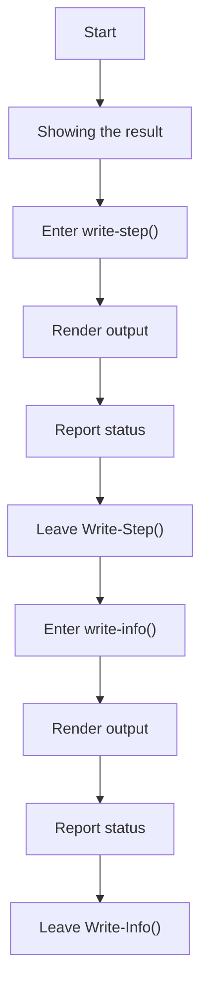
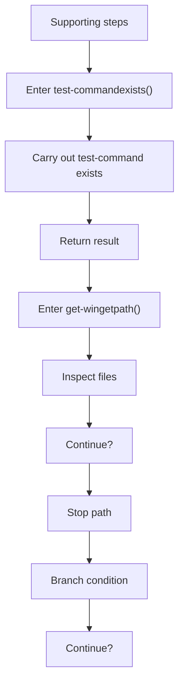
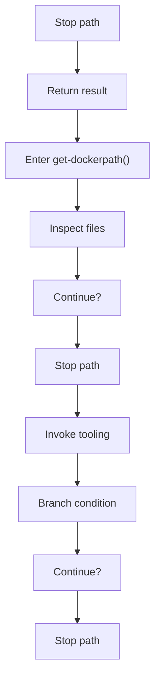
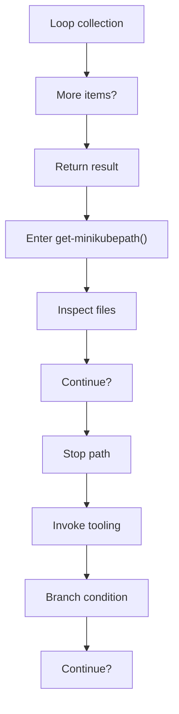
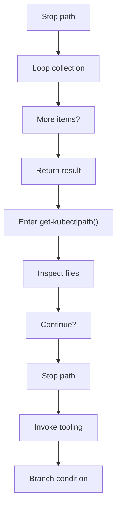
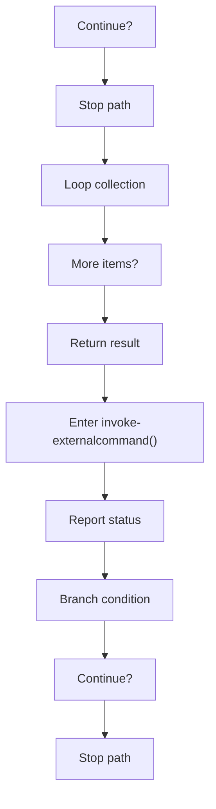
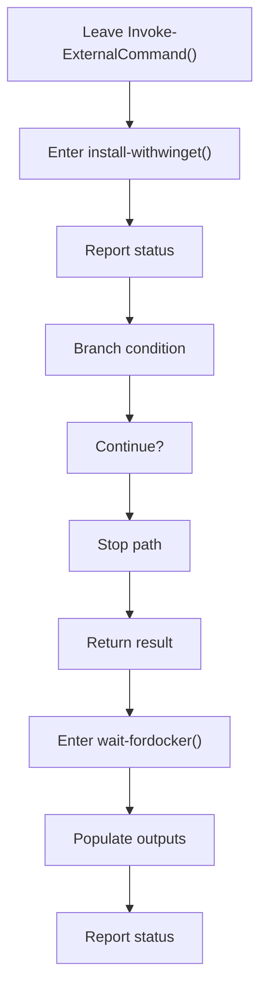
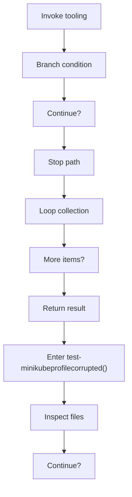

# bootstrap_and_deploy_program_flow_01.ps1

- Source document: [bootstrap_and_deploy.ps1.md](../bootstrap_and_deploy.ps1.md)
- Purpose: decoupled implementation logic for a future code unit.

This diagram follows the action path in plain words. Decision diamonds show where the file can stop, branch, or repeat work instead of simply passing through a straight line.

### Block 1 - Program Flow Details
#### Part 1

#### Part 2

#### Part 3

#### Part 4

#### Part 5

#### Part 6

#### Part 7

#### Part 8

