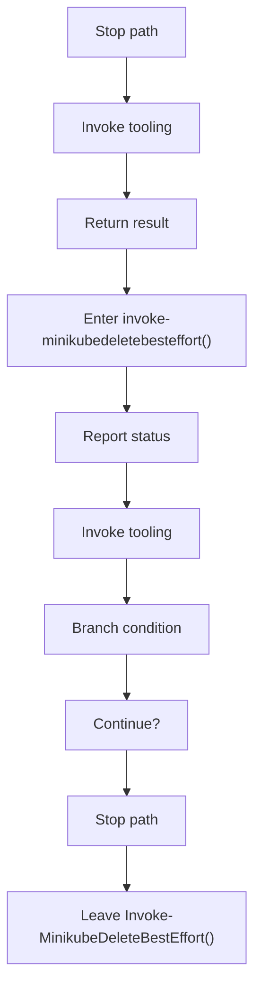
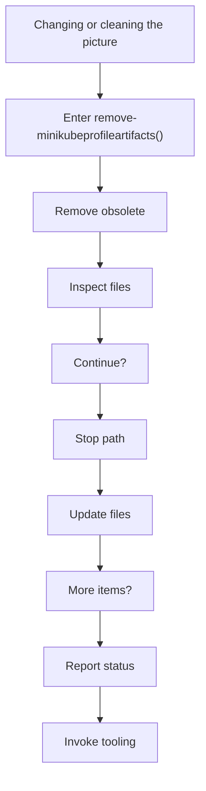
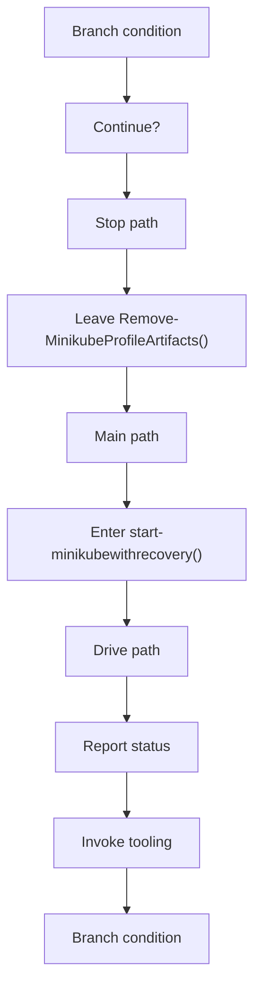
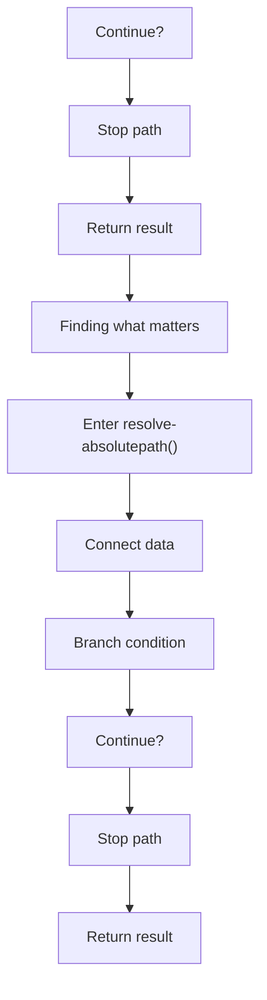
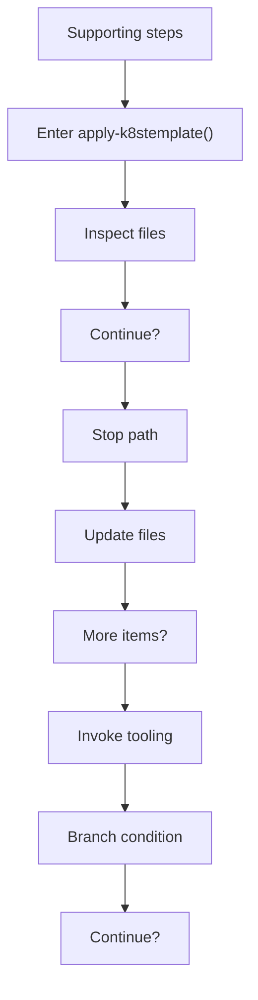
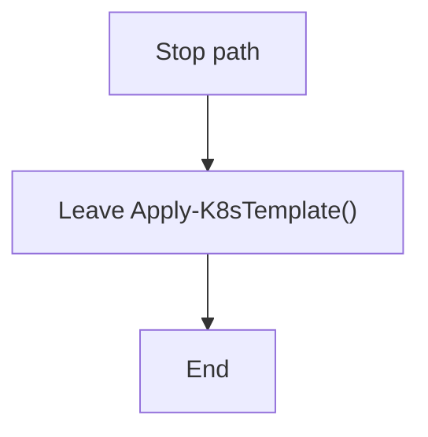

# bootstrap_and_deploy_program_flow_02.ps1

- Source document: [bootstrap_and_deploy.ps1.md](../bootstrap_and_deploy.ps1.md)
- Purpose: decoupled implementation logic for a future code unit.

#### Part 9

#### Part 10

#### Part 11

#### Part 12

#### Part 13

#### Part 14

