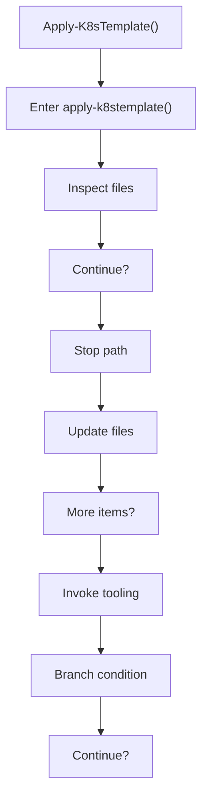
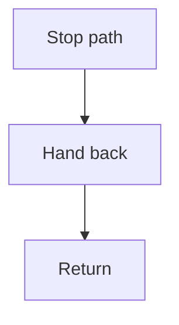

# apply_k8stemplate.ps1

- Source document: [bootstrap_and_deploy.ps1.md](../../bootstrap_and_deploy.ps1.md)
- Purpose: decoupled implementation logic for a future code unit.

### Apply-K8sTemplate()
This routine owns one focused piece of the file's behavior. It appears near line 354.

Inside the body, it mainly handles inspect the current filesystem state, create or update filesystem artifacts, invoke external tooling, and branch on runtime conditions.

It branches on runtime conditions instead of following one fixed path.

What it does:
- inspect the current filesystem state
- create or update filesystem artifacts
- invoke external tooling
- branch on runtime conditions

Flow:

### Block 7 - Apply-K8sTemplate() Details
#### Part 1

#### Part 2

