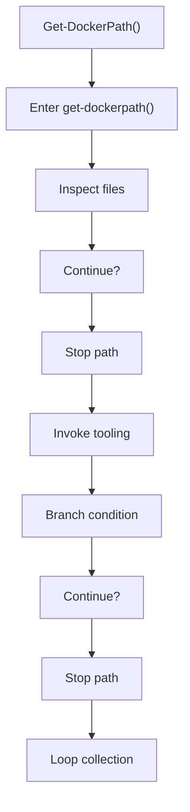
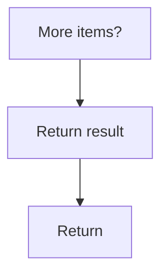

# get_dockerpath.ps1

- Source document: [bootstrap_and_deploy.ps1.md](../../bootstrap_and_deploy.ps1.md)
- Purpose: decoupled implementation logic for a future code unit.

### Get-DockerPath()
This routine owns one focused piece of the file's behavior. It appears near line 56.

Inside the body, it mainly handles inspect the current filesystem state, invoke external tooling, branch on runtime conditions, and iterate over the active collection.

The implementation iterates over a collection or repeated workload. It branches on runtime conditions instead of following one fixed path. The caller receives a computed result or status from this step.

What it does:
- inspect the current filesystem state
- invoke external tooling
- branch on runtime conditions
- iterate over the active collection

Flow:

### Block 2 - Get-DockerPath() Details
#### Part 1

#### Part 2

