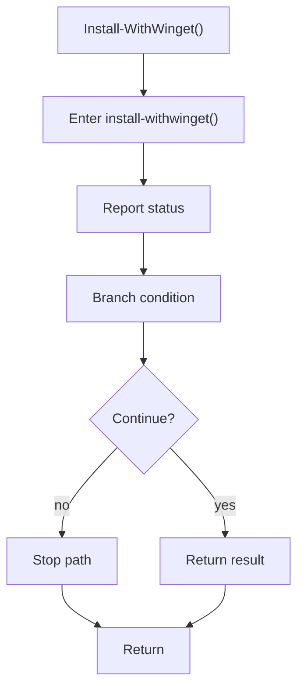

# install_withwinget.ps1

- Source document: [bootstrap_and_deploy.ps1.md](../../bootstrap_and_deploy.ps1.md)
- Purpose: decoupled implementation logic for a future code unit.

### Install-WithWinget()
This routine owns one focused piece of the file's behavior. It appears near line 148.

Inside the body, it mainly handles report status or failures to the caller and branch on runtime conditions.

It branches on runtime conditions instead of following one fixed path. The caller receives a computed result or status from this step.

What it does:
- report status or failures to the caller
- branch on runtime conditions

Flow:

