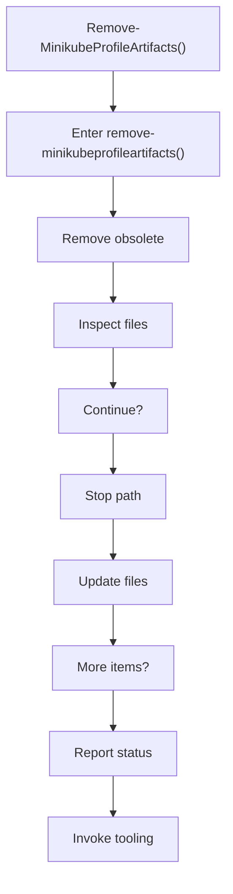
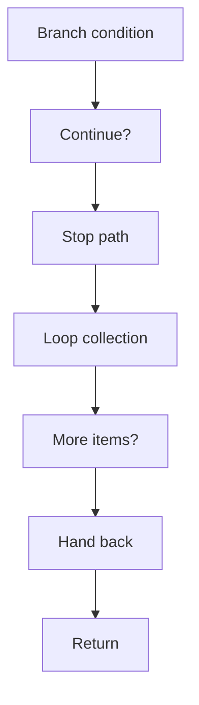

# remove_minikubeprofileartifacts.ps1

- Source document: [bootstrap_and_deploy.ps1.md](../../bootstrap_and_deploy.ps1.md)
- Purpose: decoupled implementation logic for a future code unit.

### Remove-MinikubeProfileArtifacts()
This routine owns one focused piece of the file's behavior. It appears near line 256.

Inside the body, it mainly handles remove obsolete transformed artifacts, inspect the current filesystem state, create or update filesystem artifacts, and report status or failures to the caller.

The implementation iterates over a collection or repeated workload. It branches on runtime conditions instead of following one fixed path.

What it does:
- remove obsolete transformed artifacts
- inspect the current filesystem state
- create or update filesystem artifacts
- report status or failures to the caller
- invoke external tooling
- branch on runtime conditions
- iterate over the active collection

Flow:

### Block 6 - Remove-MinikubeProfileArtifacts() Details
#### Part 1

#### Part 2

