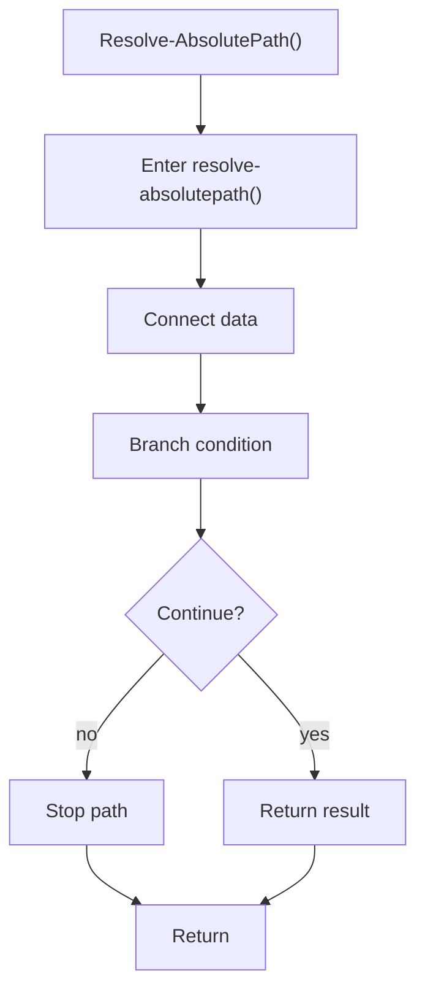

# resolve_absolutepath.ps1

- Source document: [bootstrap_and_deploy.ps1.md](../../bootstrap_and_deploy.ps1.md)
- Purpose: decoupled implementation logic for a future code unit.

### Resolve-AbsolutePath()
This routine connects discovered items back into the broader model owned by the file. It appears near line 345.

Inside the body, it mainly handles connect discovered data back into the shared model and branch on runtime conditions.

It branches on runtime conditions instead of following one fixed path. The caller receives a computed result or status from this step.

What it does:
- connect discovered data back into the shared model
- branch on runtime conditions

Flow:

