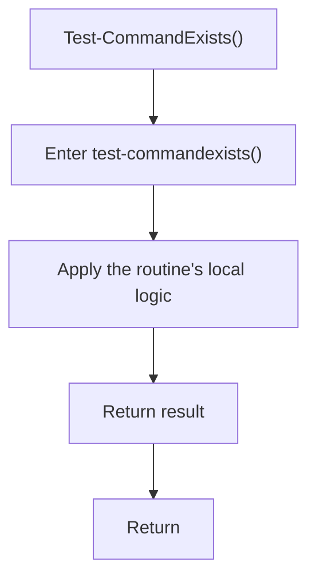

# test_commandexists.ps1

- Source document: [bootstrap_and_deploy.ps1.md](../../bootstrap_and_deploy.ps1.md)
- Purpose: decoupled implementation logic for a future code unit.

### Test-CommandExists()
This routine owns one focused piece of the file's behavior. It appears near line 27.

The caller receives a computed result or status from this step.

What it does:
- This routine is primarily structural and does not expose obvious runtime operations from static inspection.

Flow:

