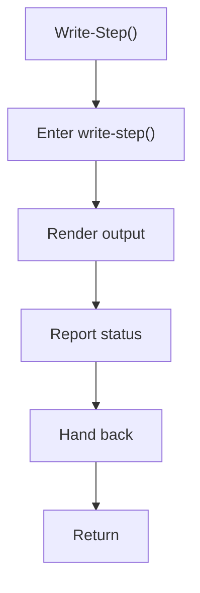

# write_step.ps1

- Source document: [bootstrap_and_deploy.ps1.md](../../bootstrap_and_deploy.ps1.md)
- Purpose: decoupled implementation logic for a future code unit.

### Write-Step()
This routine materializes internal state into an output format that later stages can consume. It appears near line 17.

Inside the body, it mainly handles render or serialize the result and report status or failures to the caller.

What it does:
- render or serialize the result
- report status or failures to the caller

Flow:

