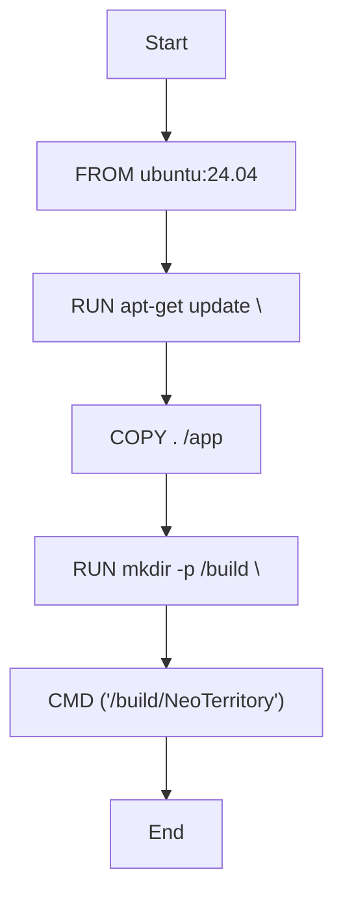

# Dockerfile

- Source: Infrastructure/session-orchestration/docker/Dockerfile
- Kind: Container build definition
- Lines: 19

## Story
### What Happens Here

This file implements the container build recipe for NeoTerritory session execution. It defines the image composition that later gets built and deployed by the bootstrap scripts.

### Why It Matters In The Flow

Runs before the C++ executable when the environment, runtime folders, container image, or Kubernetes assets need to be prepared.

### What To Watch While Reading

Builds the container image used for per-user NeoTerritory sessions. It collaborates directly with ubuntu:24.04 and . /app.

## Program Flow
This diagram follows the action path in plain words. Decision diamonds show where the file can stop, branch, or repeat work instead of simply passing through a straight line.

## Reading Map
Read this file as: Builds the container image used for per-user NeoTerritory sessions.

Where it sits in the run: Runs before the C++ executable when the environment, runtime folders, container image, or Kubernetes assets need to be prepared.

It leans on nearby contracts or tools such as ubuntu:24.04 and . /app.

## Documentation Note
- This markdown file is part of the generated docs/Codebase mirror.
- It was generated from the repository state on 2026-04-23 after reading the existing docs corpus and the current source tree.

