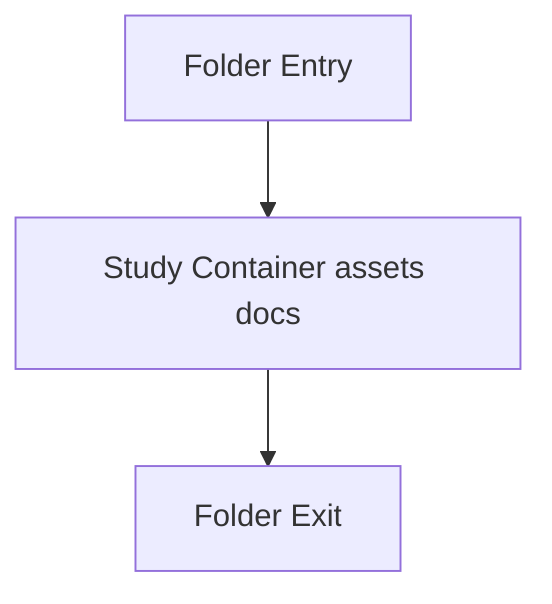

# docker

- Folder: docs/Codebase/Infrastructure/session-orchestration/docker
- Descendant source docs: 1
- Generated on: 2026-04-23

## Logic Summary
Container image definitions used by the orchestration bootstrap.

## Subsystem Story
This folder is mostly leaf-level. The local documents here carry the main explanation of the subsystem without requiring much extra descent.

## Folder Flow

## Documents By Logic
### Container Assets
These documents explain the local implementation by covering Builds the container image used for per-user NeoTerritory sessions.
- Dockerfile.md : Builds the container image used for per-user NeoTerritory sessions.

## Reading Hint
- This folder is mostly leaf-level. Read the local file docs to understand the logic in this area.

