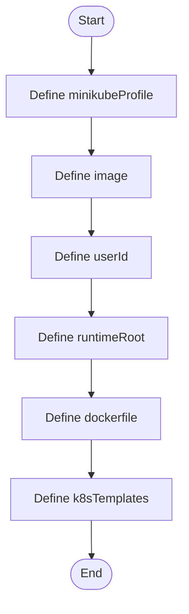

# installer.config.json

- Source: Infrastructure/session-orchestration/installer.config.json
- Kind: JSON configuration
- Lines: 12
- Role: Parameterizes the infrastructure bootstrap flow with image, profile, template, and runtime-root values.
- Chronology: Runs before the C++ executable when the environment, runtime folders, container image, or Kubernetes assets need to be prepared.

## Notable Symbols
- minikubeProfile
- image
- userId
- runtimeRoot
- dockerfile
- k8sTemplates

## Direct Dependencies
- No direct dependency list was extracted from the file text.

## File Outline
### Responsibility

This configuration file implements the parameter source for the bootstrap script. It carries the image tag, Minikube profile, runtime root, and template paths that determine how the environment is assembled.

### Position In The Flow

Runs before the C++ executable when the environment, runtime folders, container image, or Kubernetes assets need to be prepared.

### Main Surface Area

Parameterizes the infrastructure bootstrap flow with image, profile, template, and runtime-root values. The main surface area is easiest to track through symbols such as minikubeProfile, image, userId, and runtimeRoot.

## File Activity

## Documentation Note
- This markdown file is part of the generated docs/Codebase mirror.
- It was generated from the repository state on 2026-04-23 after reading the existing docs corpus and the current source tree.

