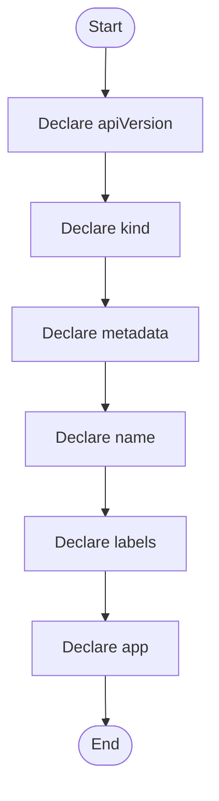

# user-session-pod.yaml

- Source: Infrastructure/session-orchestration/k8s/templates/user-session-pod.yaml
- Kind: YAML manifest
- Lines: 22
- Role: Declares user-scoped Kubernetes resources for session pods and routing.
- Chronology: Runs before the C++ executable when the environment, runtime folders, container image, or Kubernetes assets need to be prepared.

## Notable Symbols
- apiVersion
- kind
- metadata
- name
- labels
- app
- user_id
- spec
- restartPolicy
- activeDeadlineSeconds
- containers
- image

## Direct Dependencies
- No direct dependency list was extracted from the file text.

## File Outline
### Responsibility

This manifest implements one deployment-side resource in the session orchestration story. The bootstrap script renders user-specific values into it and applies it so the runtime image becomes reachable inside the local cluster.

### Position In The Flow

Runs before the C++ executable when the environment, runtime folders, container image, or Kubernetes assets need to be prepared.

### Main Surface Area

Declares user-scoped Kubernetes resources for session pods and routing. The main surface area is easiest to track through symbols such as apiVersion, kind, metadata, and name.

## File Activity

## Documentation Note
- This markdown file is part of the generated docs/Codebase mirror.
- It was generated from the repository state on 2026-04-23 after reading the existing docs corpus and the current source tree.

