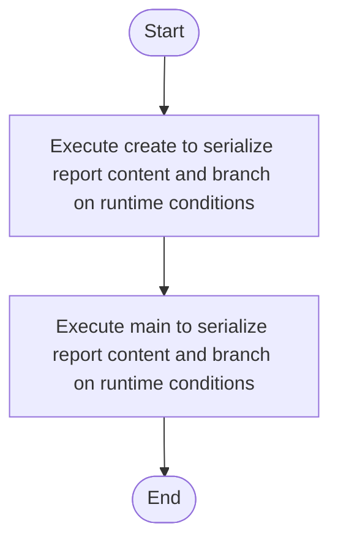

# factory_to_singleton_source.cpp

- Source: Input/factory_to_singleton_source.cpp
- Kind: C++ implementation
- Lines: 46
- Role: Provides sample source programs for manual or research-oriented runs.
- Chronology: These files are consumed as sample inputs before or during a run rather than executed as infrastructure or service code.

## Notable Symbols
- Report
- JsonReport
- CsvReport
- ReportFactory
- print
- create
- main

## Direct Dependencies
- iostream
- memory
- string

## File Outline
### Responsibility

This file implements a sample input scenario rather than part of the runtime engine itself. Its code exists to be consumed by the microservice so the parser, detector, and transform pipeline can be exercised on a known pattern example.

### Position In The Flow

These files are consumed as sample inputs before or during a run rather than executed as infrastructure or service code.

### Main Surface Area

Provides sample source programs for manual or research-oriented runs. The main surface area is easiest to track through symbols such as Report, JsonReport, CsvReport, and ReportFactory. It collaborates directly with iostream, memory, and string.

## File Activity


## Function Walkthrough

### create
This routine assembles a larger structure from the inputs it receives. It appears near line 22.

Inside the body, it mainly handles serialize report content and branch on runtime conditions.

It branches on runtime conditions instead of following one fixed path. The caller receives a computed result or status from this step.

Key operations:
- serialize report content
- branch on runtime conditions

Activity:
```mermaid
flowchart TD
    Start([create()])
    N0[Enter create()]
    N1[Serialize report content]
    N2[Branch on runtime conditions]
    N3[Return the result to the caller]
    End([Return])
    Start --> N0
    N0 --> N1
    N1 --> N2
    N2 --> N3
    N3 --> End
```

### main
This routine owns one focused piece of the file's behavior. It appears near line 36.

Inside the body, it mainly handles serialize report content and branch on runtime conditions.

It branches on runtime conditions instead of following one fixed path. The caller receives a computed result or status from this step.

Key operations:
- serialize report content
- branch on runtime conditions

Activity:
```mermaid
flowchart TD
    Start([main()])
    N0[Enter main()]
    N1[Serialize report content]
    N2[Branch on runtime conditions]
    N3[Return the result to the caller]
    End([Return])
    Start --> N0
    N0 --> N1
    N1 --> N2
    N2 --> N3
    N3 --> End
```

## Documentation Note
- This markdown file is part of the generated docs/Codebase mirror.
- It was generated from the repository state on 2026-04-23 after reading the existing docs corpus and the current source tree.

