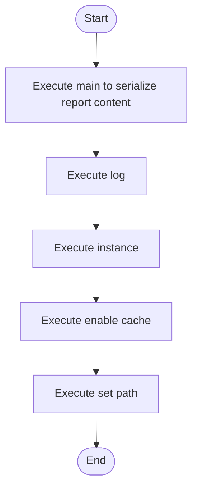

# singleton_to_factory_source.cpp

- Source: Input/singleton_to_factory_source.cpp
- Kind: C++ implementation
- Lines: 29
- Role: Provides sample source programs for manual or research-oriented runs.
- Chronology: These files are consumed as sample inputs before or during a run rather than executed as infrastructure or service code.

## Notable Symbols
- SettingsStore
- instance
- set_path
- enable_cache
- log
- main

## Direct Dependencies
- iostream
- string

## File Outline
### Responsibility

This file implements a sample input scenario rather than part of the runtime engine itself. Its code exists to be consumed by the microservice so the parser, detector, and transform pipeline can be exercised on a known pattern example.

### Position In The Flow

These files are consumed as sample inputs before or during a run rather than executed as infrastructure or service code.

### Main Surface Area

Provides sample source programs for manual or research-oriented runs. The main surface area is easiest to track through symbols such as SettingsStore, instance, set_path, and enable_cache. It collaborates directly with iostream and string.

## File Activity


## Function Walkthrough

### instance
This routine owns one focused piece of the file's behavior. It appears near line 5.

The caller receives a computed result or status from this step.

Key operations:
- This routine is primarily structural and does not expose obvious runtime operations from static inspection.

Activity:
```mermaid
flowchart TD
    Start([instance()])
    N0[Enter instance()]
    N1[Apply the routine's local logic]
    N2[Return the result to the caller]
    End([Return])
    Start --> N0
    N0 --> N1
    N1 --> N2
    N2 --> End
```

### set_path
This routine owns one focused piece of the file's behavior. It appears near line 11.

Key operations:
- This routine is primarily structural and does not expose obvious runtime operations from static inspection.

Activity:
```mermaid
flowchart TD
    Start([set_path()])
    N0[Enter set_path()]
    N1[Apply the routine's local logic]
    N2[Hand control back to the caller]
    End([Return])
    Start --> N0
    N0 --> N1
    N1 --> N2
    N2 --> End
```

### enable_cache
This routine owns one focused piece of the file's behavior. It appears near line 13.

Key operations:
- This routine is primarily structural and does not expose obvious runtime operations from static inspection.

Activity:
```mermaid
flowchart TD
    Start([enable_cache()])
    N0[Enter enable_cache()]
    N1[Apply the routine's local logic]
    N2[Hand control back to the caller]
    End([Return])
    Start --> N0
    N0 --> N1
    N1 --> N2
    N2 --> End
```

### log
This routine owns one focused piece of the file's behavior. It appears near line 14.

Key operations:
- This routine is primarily structural and does not expose obvious runtime operations from static inspection.

Activity:
```mermaid
flowchart TD
    Start([log()])
    N0[Enter log()]
    N1[Apply the routine's local logic]
    N2[Hand control back to the caller]
    End([Return])
    Start --> N0
    N0 --> N1
    N1 --> N2
    N2 --> End
```

### main
This routine owns one focused piece of the file's behavior. It appears near line 20.

Inside the body, it mainly handles serialize report content.

The caller receives a computed result or status from this step.

Key operations:
- serialize report content

Activity:
```mermaid
flowchart TD
    Start([main()])
    N0[Enter main()]
    N1[Serialize report content]
    N2[Return the result to the caller]
    End([Return])
    Start --> N0
    N0 --> N1
    N1 --> N2
    N2 --> End
```

## Documentation Note
- This markdown file is part of the generated docs/Codebase mirror.
- It was generated from the repository state on 2026-04-23 after reading the existing docs corpus and the current source tree.

