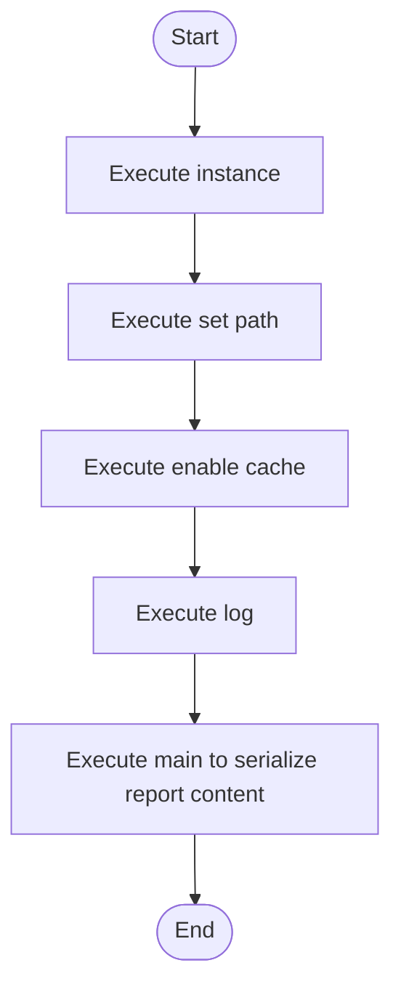

# singleton_to_factory_source.cpp

- Source: Input/singleton_to_factory_source.cpp
- Kind: C++ implementation
- Lines: 29
- Role: Provides sample source programs for manual or research-oriented runs.
- Chronology: These files are consumed as sample inputs before or during a run rather than executed as infrastructure or service code.

## Notable Symbols
- SettingsStore
- instance
- set_path
- enable_cache
- log
- main

## Direct Dependencies
- iostream
- string

## Implementation Story
This file implements a sample input scenario rather than part of the runtime engine itself. Its code exists to be consumed by the microservice so the parser, detector, and transform pipeline can be exercised on a known pattern example. Provides sample source programs for manual or research-oriented runs. These files are consumed as sample inputs before or during a run rather than executed as infrastructure or service code. The implementation surface is easiest to recognize through symbols such as SettingsStore, instance, set_path, and enable_cache. In practice it collaborates directly with iostream and string.

## Activity Diagram

## Documentation Note
- This markdown file is part of the generated docs/Codebase mirror.
- It was generated from the repository state on 2026-04-22 after reading the existing docs corpus and the current source tree.

