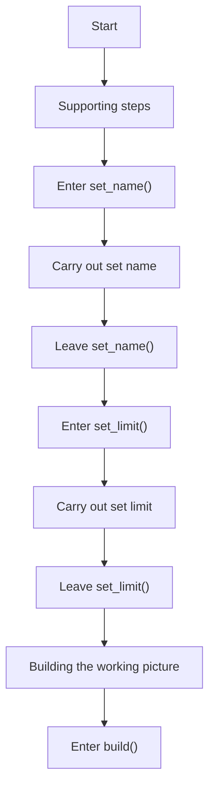
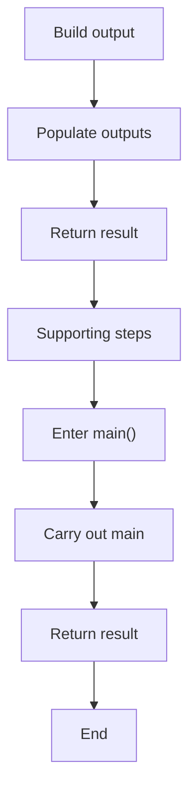
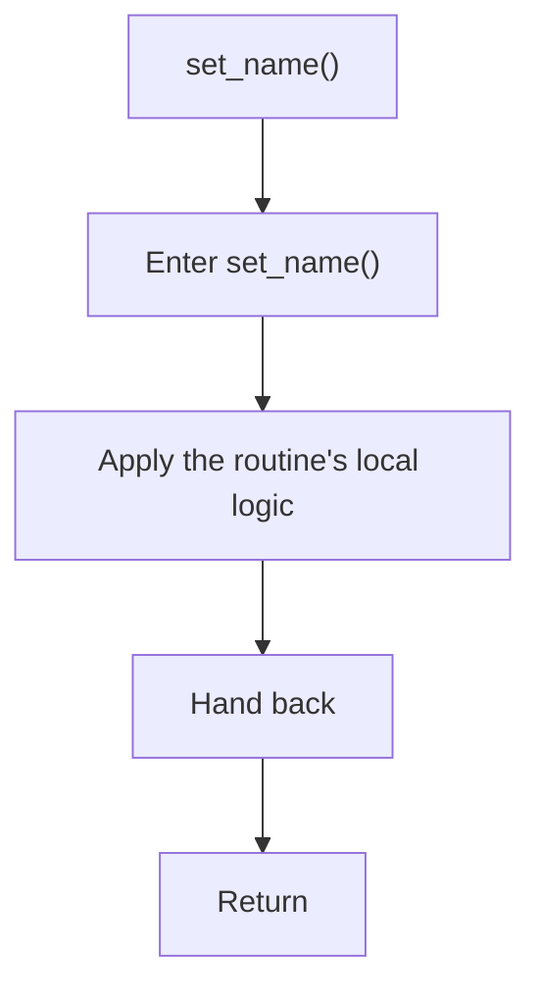
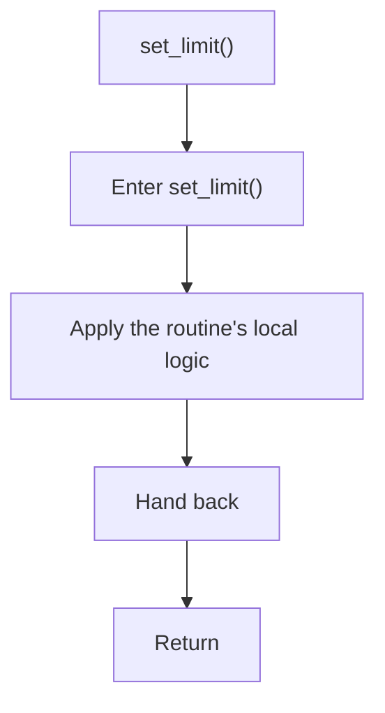
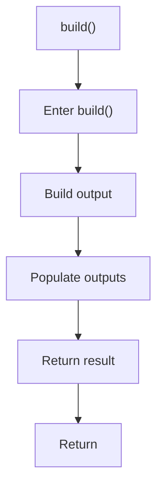
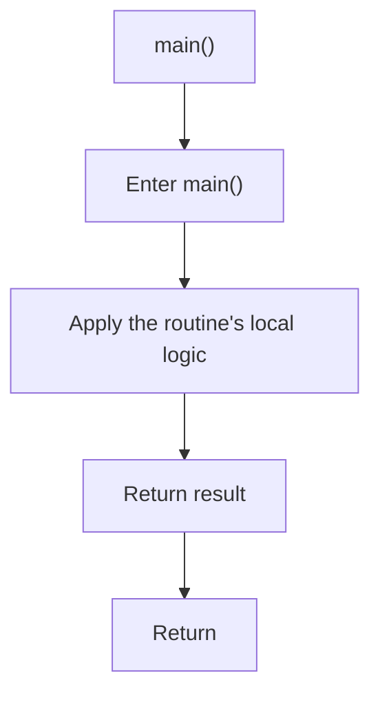

# legacy_builder_to_singleton_sample.cpp

- Source: LegacyPatternTransformSamples/legacy_builder_to_singleton_sample.cpp
- Kind: C++ implementation
- Lines: 46

## Story
### What Happens Here

This file implements a legacy pattern-transform scenario rather than part of the current runtime engine. Its code is kept to document the older design-pattern-changing system while the active analyzer focuses on tagging evidence.

### Why It Matters In The Flow

These files document the older design-pattern transformation corpus rather than the current tagging-first runtime.

### What To Watch While Reading

Provides legacy sample source programs from the older pattern-to-pattern transform system. The main surface area is easiest to track through symbols such as Query, QueryBuilder, set_name, and set_limit. It collaborates directly with string.

## Program Flow
This diagram follows the action path in plain words. Decision diamonds show where the file can stop, branch, or repeat work instead of simply passing through a straight line.

### Block 1 - Program Flow Details
#### Part 1

#### Part 2

## Reading Map
Read this file as: Provides legacy sample source programs from the older pattern-to-pattern transform system.

Where it sits in the run: These files document the older design-pattern transformation corpus rather than the current tagging-first runtime.

Names worth recognizing while reading: Query, QueryBuilder, set_name, set_limit, build, and main.

It leans on nearby contracts or tools such as string.

## Story Groups

### Building The Working Picture
These steps assemble the trees, models, or bundles used by the rest of the file.
- build() (line 26): Build or append the next output structure and populate output fields or accumulators

### Supporting Steps
These steps support the local behavior of the file.
- set_name() (line 5): Owns a focused local responsibility.
- set_limit() (line 6): Owns a focused local responsibility.
- main() (line 39): Owns a focused local responsibility.

## Function Stories

### set_name()
This routine owns one focused piece of the file's behavior. It appears near line 5.

What it does:
- This routine is primarily structural and does not expose obvious runtime operations from static inspection.

Flow:

### set_limit()
This routine owns one focused piece of the file's behavior. It appears near line 6.

What it does:
- This routine is primarily structural and does not expose obvious runtime operations from static inspection.

Flow:

### build()
This routine assembles a larger structure from the inputs it receives. It appears near line 26.

Inside the body, it mainly handles build or append the next output structure and populate output fields or accumulators.

The caller receives a computed result or status from this step.

What it does:
- build or append the next output structure
- populate output fields or accumulators

Flow:

### main()
This routine owns one focused piece of the file's behavior. It appears near line 39.

The caller receives a computed result or status from this step.

What it does:
- This routine is primarily structural and does not expose obvious runtime operations from static inspection.

Flow:

## Documentation Note
- This markdown file is part of the generated docs/Codebase mirror.
- It was generated from the repository state on 2026-04-23 after reading the existing docs corpus and the current source tree.
