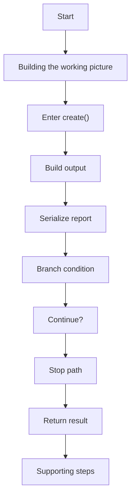
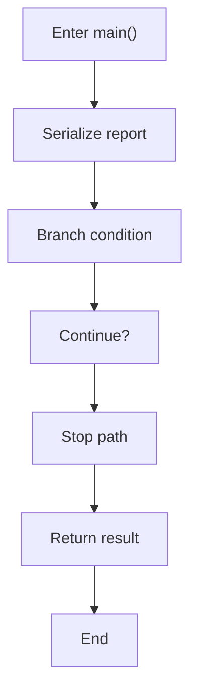
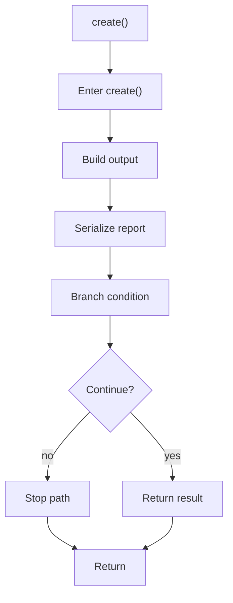
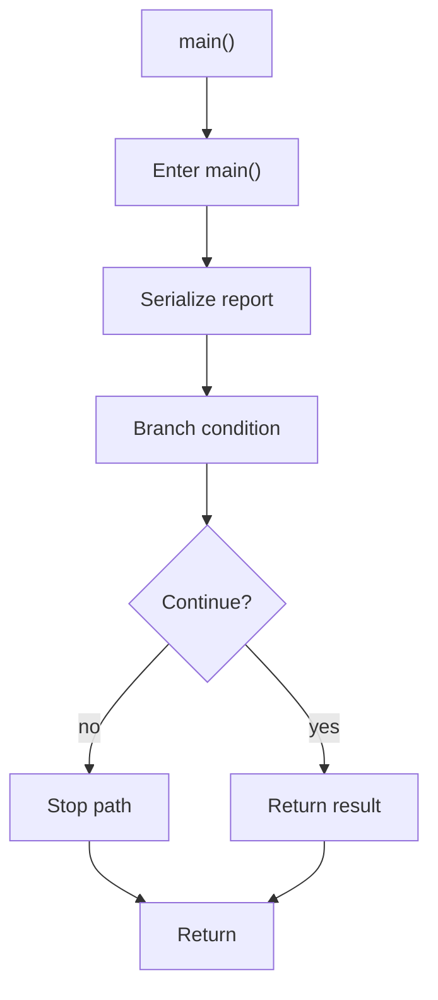

# legacy_factory_to_singleton_sample.cpp

- Source: LegacyPatternTransformSamples/legacy_factory_to_singleton_sample.cpp
- Kind: C++ implementation
- Lines: 46

## Story
### What Happens Here

This file implements a legacy pattern-transform scenario rather than part of the current runtime engine. Its code is kept to document the older design-pattern-changing system while the active analyzer focuses on tagging evidence.

### Why It Matters In The Flow

These files document the older design-pattern transformation corpus rather than the current tagging-first runtime.

### What To Watch While Reading

Provides legacy sample source programs from the older pattern-to-pattern transform system. The main surface area is easiest to track through symbols such as Report, JsonReport, CsvReport, and ReportFactory. It collaborates directly with iostream, memory, and string.

## Program Flow
This diagram follows the action path in plain words. Decision diamonds show where the file can stop, branch, or repeat work instead of simply passing through a straight line.

### Block 1 - Program Flow Details
#### Part 1

#### Part 2

## Reading Map
Read this file as: Provides legacy sample source programs from the older pattern-to-pattern transform system.

Where it sits in the run: These files document the older design-pattern transformation corpus rather than the current tagging-first runtime.

Names worth recognizing while reading: Report, JsonReport, CsvReport, ReportFactory, print, and create.

It leans on nearby contracts or tools such as iostream, memory, and string.

## Story Groups

### Building The Working Picture
These steps assemble the trees, models, or bundles used by the rest of the file.
- create() (line 23): Build or append the next output structure, serialize report content, and branch on runtime conditions

### Supporting Steps
These steps support the local behavior of the file.
- main() (line 36): Serialize report content and branch on runtime conditions

## Function Stories

### create()
This routine assembles a larger structure from the inputs it receives. It appears near line 23.

Inside the body, it mainly handles build or append the next output structure, serialize report content, and branch on runtime conditions.

It branches on runtime conditions instead of following one fixed path. The caller receives a computed result or status from this step.

What it does:
- build or append the next output structure
- serialize report content
- branch on runtime conditions

Flow:

### main()
This routine owns one focused piece of the file's behavior. It appears near line 36.

Inside the body, it mainly handles serialize report content and branch on runtime conditions.

It branches on runtime conditions instead of following one fixed path. The caller receives a computed result or status from this step.

What it does:
- serialize report content
- branch on runtime conditions

Flow:

## Documentation Note
- This markdown file is part of the generated docs/Codebase mirror.
- It was generated from the repository state on 2026-04-23 after reading the existing docs corpus and the current source tree.
