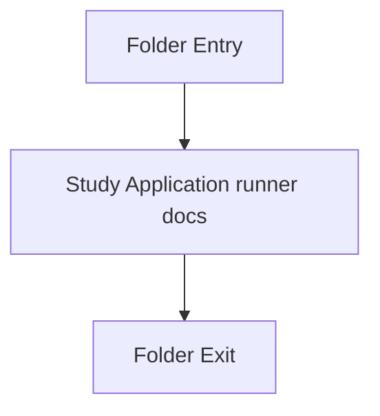

# Back system

- Folder: docs/Codebase/Microservice/Layer/Back system
- Descendant source docs: 1
- Generated on: 2026-04-23

## Logic Summary
The runtime runner that ties CLI parsing, file discovery, pipeline execution, and output writing together.

## Subsystem Story
This folder is mostly leaf-level. The local documents here carry the main explanation of the subsystem without requiring much extra descent.

## Folder Flow

## Documents By Logic
### Application Runner
These documents explain the local implementation by covering Owns application-layer orchestration around parsing, documentation tagging, and report emission..
- syntacticBrokenAST.cpp.md : Owns application-layer orchestration around parsing, documentation tagging, and report emission.

## Reading Hint
- This folder is mostly leaf-level. Read the local file docs to understand the logic in this area.

