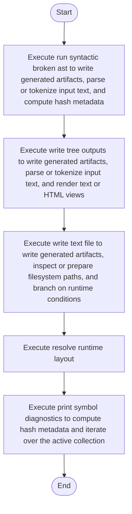

# syntacticBrokenAST.cpp

- Source: Microservice/Layer/Back system/syntacticBrokenAST.cpp
- Kind: C++ implementation
- Lines: 450
- Role: Owns application-layer orchestration around parsing, generation, and report emission.
- Chronology: Runs after process startup to validate CLI args, discover input files, execute the pipeline, and write outputs.

## Notable Symbols
- RuntimeLayout
- supported_extensions_text
- print_error_diagnostics
- get_executable_dir
- std::filesystem::current_path
- ensure_directory
- std::filesystem::exists
- has_supported_extension
- discover_input_files
- resolve_runtime_layout
- ensure_runtime_layout
- write_text_file

## Direct Dependencies
- source_reader.hpp
- algorithm_pipeline.hpp
- cli_arguments.hpp
- codebase_output_writer.hpp
- lexical_structure_hooks.hpp
- parse_tree.hpp
- parse_tree_code_generator.hpp
- parse_tree_symbols.hpp
- creational_broken_tree.hpp
- behavioural_broken_tree.hpp
- filesystem
- fstream

## Implementation Story
This application-layer source file implements the runtime story that wraps the core parser modules. It is responsible for validating arguments, discovering files, invoking the analysis pipeline, and materializing all of the generated outputs. Owns application-layer orchestration around parsing, generation, and report emission. Runs after process startup to validate CLI args, discover input files, execute the pipeline, and write outputs. The implementation surface is easiest to recognize through symbols such as RuntimeLayout, supported_extensions_text, print_error_diagnostics, and get_executable_dir. In practice it collaborates directly with source_reader.hpp, algorithm_pipeline.hpp, cli_arguments.hpp, and codebase_output_writer.hpp.

## Activity Diagram

## Documentation Note
- This markdown file is part of the generated docs/Codebase mirror.
- It was generated from the repository state on 2026-04-22 after reading the existing docs corpus and the current source tree.

