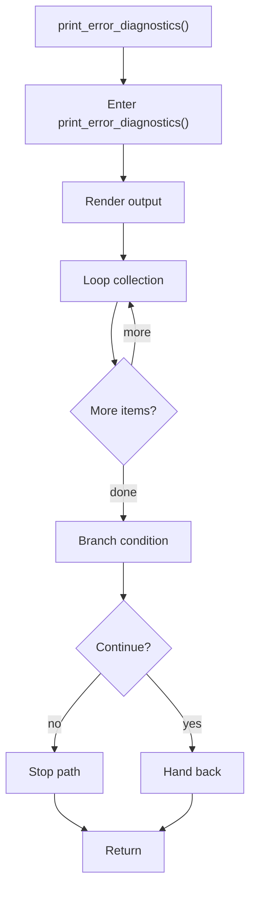

# print_error_diagnostics.cpp

- Source document: [syntacticBrokenAST.cpp.md](../../syntacticBrokenAST.cpp.md)
- Purpose: decoupled implementation logic for a future code unit.

### print_error_diagnostics()
This routine materializes internal state into an output format that later stages can consume. It appears near line 48.

Inside the body, it mainly handles render or serialize the result, iterate over the active collection, and branch on runtime conditions.

The implementation iterates over a collection or repeated workload. It branches on runtime conditions instead of following one fixed path.

What it does:
- render or serialize the result
- iterate over the active collection
- branch on runtime conditions

Flow:

