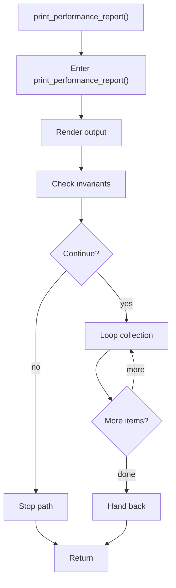

# print_performance_report.cpp

- Source document: [syntacticBrokenAST.cpp.md](../../syntacticBrokenAST.cpp.md)
- Purpose: decoupled implementation logic for a future code unit.

### print_performance_report()
This routine materializes internal state into an output format that later stages can consume. It appears near line 205.

Inside the body, it mainly handles render or serialize the result, validate pipeline invariants, and iterate over the active collection.

The implementation iterates over a collection or repeated workload.

What it does:
- render or serialize the result
- validate pipeline invariants
- iterate over the active collection

Flow:

