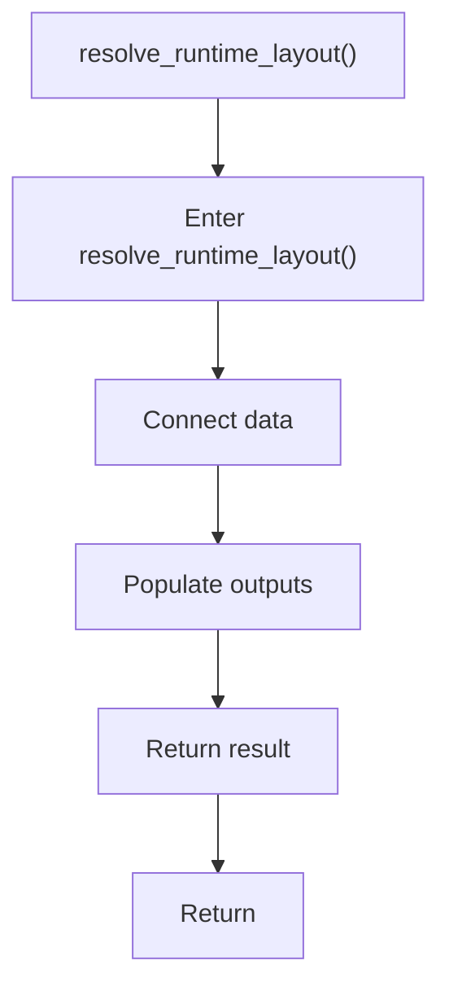

# resolve_runtime_layout.cpp

- Source document: [syntacticBrokenAST.cpp.md](../../syntacticBrokenAST.cpp.md)
- Purpose: decoupled implementation logic for a future code unit.

### resolve_runtime_layout()
This routine connects discovered items back into the broader model owned by the file. It appears near line 122.

Inside the body, it mainly handles connect discovered data back into the shared model and populate output fields or accumulators.

The caller receives a computed result or status from this step.

What it does:
- connect discovered data back into the shared model
- populate output fields or accumulators

Flow:

