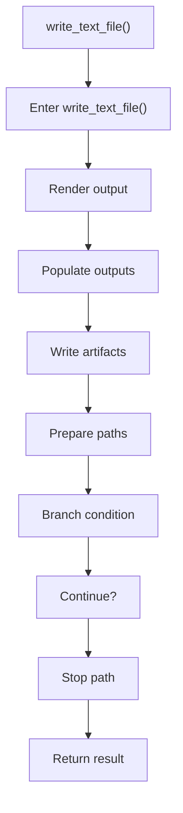

# write_text_file.cpp

- Source document: [syntacticBrokenAST.cpp.md](../../syntacticBrokenAST.cpp.md)
- Purpose: decoupled implementation logic for a future code unit.

### write_text_file()
This routine materializes internal state into an output format that later stages can consume. It appears near line 154.

Inside the body, it mainly handles render or serialize the result, populate output fields or accumulators, write generated artifacts, and inspect or prepare filesystem paths.

It branches on runtime conditions instead of following one fixed path. The caller receives a computed result or status from this step.

What it does:
- render or serialize the result
- populate output fields or accumulators
- write generated artifacts
- inspect or prepare filesystem paths
- branch on runtime conditions

Flow:

### Block 4 - write_text_file() Details
#### Part 1

#### Part 2

