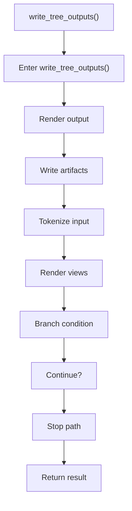

# write_tree_outputs.cpp

- Source document: [syntacticBrokenAST.cpp.md](../../syntacticBrokenAST.cpp.md)
- Purpose: decoupled implementation logic for a future code unit.

### write_tree_outputs()
This routine materializes internal state into an output format that later stages can consume. It appears near line 176.

Inside the body, it mainly handles render or serialize the result, write generated artifacts, parse or tokenize input text, and render text or HTML views.

It branches on runtime conditions instead of following one fixed path. The caller receives a computed result or status from this step.

What it does:
- render or serialize the result
- write generated artifacts
- parse or tokenize input text
- render text or HTML views
- branch on runtime conditions

Flow:

### Block 5 - write_tree_outputs() Details
#### Part 1

#### Part 2

