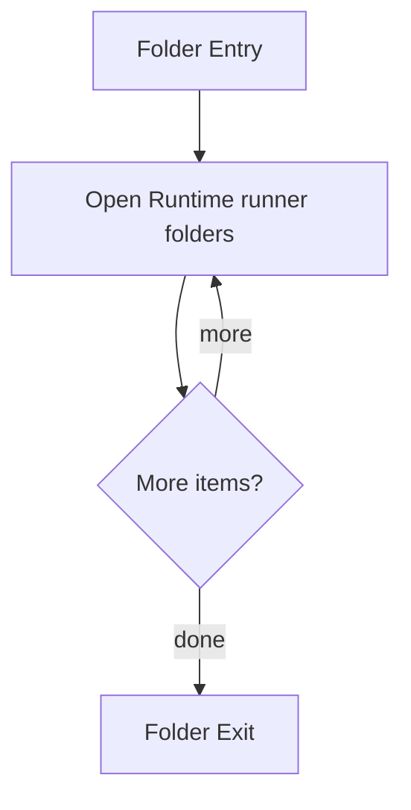

# Layer

- Folder: docs/Codebase/Microservice/Layer
- Descendant source docs: 1
- Generated on: 2026-04-23

## Logic Summary
Application-layer orchestration around the deeper module code.

## Subsystem Story
This folder mainly acts as a navigation layer. Use it to understand how the deeper child folders divide the subsystem into smaller concerns.

## Folder Flow

## Child Folders By Logic
### Runtime Runner
These child folders continue the subsystem by covering The runtime runner that ties CLI parsing, file discovery, pipeline execution, and output writing together..
- Back system/ : The runtime runner that ties CLI parsing, file discovery, pipeline execution, and output writing together.

## Reading Hint
- Use the child folder groups to navigate deeper into this subsystem.

